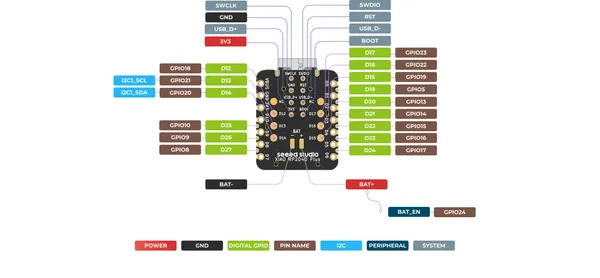
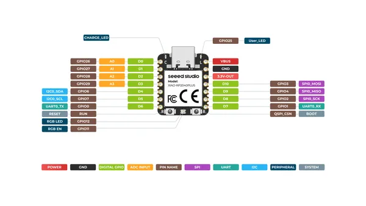

# XIAO RP2040 Plus

**Seeed Studio** · RP2040

Revision: Not identified

Coverage: Pinout image collected

[Browse all manufacturers](../../../../BROWSE.md) · [Devices & IoT](../../../../DEVICES.md) · [Open in the browser guide](https://valleytech-black-wire-guide.pages.dev/?board=seeed-studio-rp2040-xiao-rp2040-plus)

## Datasheets and original documentation

Board datasheet: **not yet recorded**. Visual reference: **available**.

[Manufacturer source (recorded link)](https://wiki.seeedstudio.com/XIAO-RP2040/)

A chip datasheet, schematic and board datasheet have different scopes. Match the exact hardware revision.

[Documentation coverage and remaining gaps](../../../../DOCUMENTATION.md)

## Pinout (Back)

**pinout image** · Reviewed source · PNG

[Open original reference](../../../../library/media/7b404a6f8b37b4fdae6c2287b41538b4e3807c530f7d6d96816605ebed0281c6.png)

**Credit and rights:** Not established; source attribution retained. Source/manufacturer: Seeed Studio.

[Source 1](https://files.seeedstudio.com/wiki/XIAO-RP2040/img/XIAO-RP2040-Plus-Back.png) · [Source 2](https://wiki.seeedstudio.com/XIAO-RP2040/)

Image revision: Not identified

SHA-256: `7b404a6f8b37b4fdae6c2287b41538b4e3807c530f7d6d96816605ebed0281c6`

## Pinout (Front)

**pinout image** · Reviewed source · PNG

[Open original reference](../../../../library/media/3b654d5c968aff0819595e0e94f47ce746ed846882593688907320a6373cd274.png)

**Credit and rights:** Not established; source attribution retained. Source/manufacturer: Seeed Studio.

[Source 1](https://files.seeedstudio.com/wiki/XIAO-RP2040/img/XIAO-RP2040-Plus-Front.png) · [Source 2](https://wiki.seeedstudio.com/XIAO-RP2040/)

Image revision: Not identified

SHA-256: `3b654d5c968aff0819595e0e94f47ce746ed846882593688907320a6373cd274`

## Pinout Sheet

**source reference** · Unreviewed source · XLSX

[Open original reference](../../../../library/media/975deb682db46b57e2874eec1ce68c112e882107111945eb9ea26c2d656b3f06.xlsx)

**Credit and rights:** Source rights not yet established. Source/manufacturer: Seeed Studio.

[Source 1](https://files.seeedstudio.com/wiki/XIAO-RP2040/res/XIAO-RP2040-Plus-pinout.xlsx) · [Source 2](https://wiki.seeedstudio.com/XIAO-RP2040/)

Original source index: Pinout Sheet. This file is searchable but has not been promoted to a reviewed physical board pinout.

Image revision: Not identified

SHA-256: `975deb682db46b57e2874eec1ce68c112e882107111945eb9ea26c2d656b3f06`

Pin assignments have not been independently electrically verified. Check board revision before wiring.
