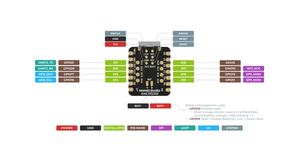
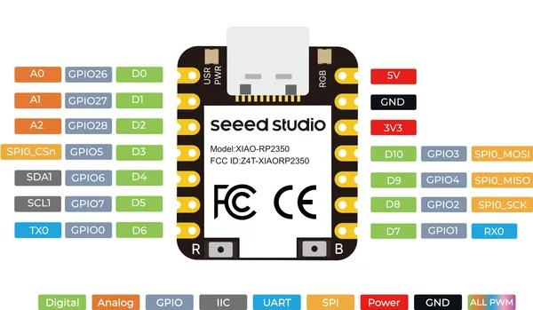
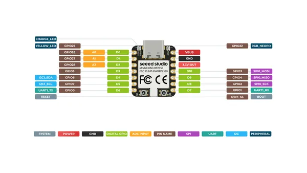

# XIAO RP2350

**Seeed Studio** · RP2350

Revision: Not identified  
Coverage: Pinout image collected

[Browse all manufacturers](../../../../BROWSE.md) · [Desktop app](https://github.com/valleytechsolutions/black-wire-desktop)

## Pinout (Back)

**pinout image** · Reviewed source · PNG

[Open original reference](../../../../library/media/72cc615fd60b9992768d97ef0de46a3dfb13ab4d5c25542d8b524deb595c448b.png)

**Credit and rights:** Not established; source attribution retained. Source/manufacturer: Seeed Studio.

[Source 1](https://files.seeedstudio.com/wiki/XIAO-RP2350/img/XIAO_RP2350_back_pinout.png) · [Source 2](https://wiki.seeedstudio.com/xiao_rp2350_arduino/)

SHA-256: `72cc615fd60b9992768d97ef0de46a3dfb13ab4d5c25542d8b524deb595c448b`

## Pinout (Front) 2

**pinout image** · Reviewed source · PNG

[Open original reference](../../../../library/media/1ba81a55b17f1f787df393ae30be3bc1a7fb49c257b448bfeee5ab06528f2303.png)

**Credit and rights:** Not established; source attribution retained. Source/manufacturer: Seeed Studio.

[Source 1](https://files.seeedstudio.com/wiki/microblocks/xiao-rp2350-pinout.png) · [Source 2](https://wiki.seeedstudio.com/xiao_rp2350_microblocks/)

SHA-256: `1ba81a55b17f1f787df393ae30be3bc1a7fb49c257b448bfeee5ab06528f2303`

## Pinout (Front)

**pinout image** · Reviewed source · PNG

[Open original reference](../../../../library/media/5cfbdc30658e37a0c2aa6a259581282c88a35bda0df2fe6142c250293c77af94.png)

**Credit and rights:** Not established; source attribution retained. Source/manufacturer: Seeed Studio.

[Source 1](https://files.seeedstudio.com/wiki/XIAO-RP2350/img/XIAO_RP2350_front_pinout.png) · [Source 2](https://wiki.seeedstudio.com/xiao_rp2350_arduino/)

SHA-256: `5cfbdc30658e37a0c2aa6a259581282c88a35bda0df2fe6142c250293c77af94`

## Pinout Sheet

**source reference** · Unreviewed source · XLSX

[Open original reference](../../../../library/media/a7946ea79140aaa9ed5fa9e18047ab1608cc06ede6f275736e9da64ad8c6c807.xlsx)

**Credit and rights:** Source rights not yet established. Source/manufacturer: Seeed Studio.

[Source 1](https://files.seeedstudio.com/wiki/XIAO-RP2350/res/XIAO-RP2350-pinout-sheet.xlsx) · [Source 2](https://wiki.seeedstudio.com/xiao_rp2350_arduino/)

Original source index: Pinout Sheet. This file is searchable but has not been promoted to a reviewed physical board pinout.

SHA-256: `a7946ea79140aaa9ed5fa9e18047ab1608cc06ede6f275736e9da64ad8c6c807`

Pin assignments have not been independently electrically verified. Check board revision before wiring.
