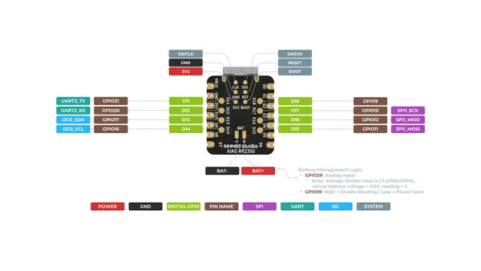
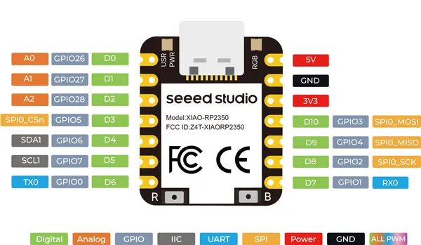
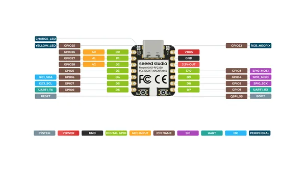
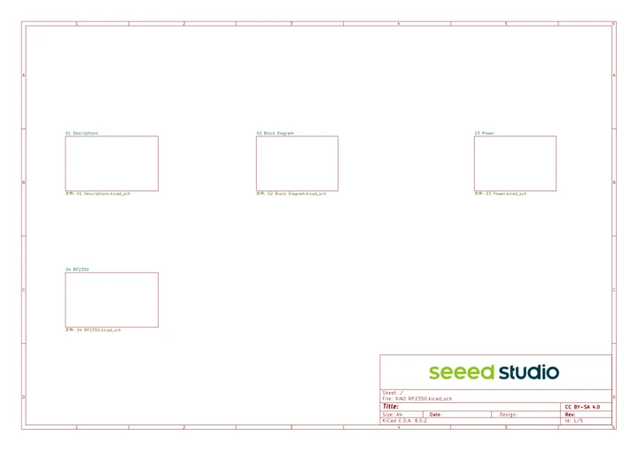

# XIAO RP2350

**Seeed Studio** · RP2350

Revision: Not identified

Coverage: Manufacturer references reviewed by scope; independent electrical and all-connector review pending

[Browse all manufacturers](../../../../BROWSE.md) · [Devices & IoT](../../../../DEVICES.md) · [Open in the browser guide](https://valleytech-black-wire-guide.pages.dev/?board=seeed-studio-rp2350-xiao-rp2350)

## Datasheets and original documentation

Board datasheet: **not yet recorded**. Visual reference: **available**.

[Manufacturer hardware documentation](https://wiki.seeedstudio.com/xiao_rp2350_arduino/)

- **schematic / board**: [XIAO RP2350 Schematic](https://files.seeedstudio.com/wiki/XIAO-RP2350/res/Seeed-Studio-XIAO-RP2350-v1.0.pdf) · [saved document](../../../../library/media/bd1c16ac32eb65bc1c389afbfea3ee90e321ba4b7e1804a6505d646774490bdd.pdf)
- **hardware-guide / board**: [Manufacturer pin and hardware documentation](https://wiki.seeedstudio.com/xiao_rp2350_arduino/) · online

A chip datasheet, schematic and board datasheet have different scopes. Match the exact hardware revision.

[Documentation coverage and remaining gaps](../../../../DOCUMENTATION.md)

## Pinout (Back)

**pinout image** · Reviewed source · PNG

[Open original reference](../../../../library/media/72cc615fd60b9992768d97ef0de46a3dfb13ab4d5c25542d8b524deb595c448b.png)

**Credit and rights:** Not established; source attribution retained. Source/manufacturer: Seeed Studio.

[Source 1](https://files.seeedstudio.com/wiki/XIAO-RP2350/img/XIAO_RP2350_back_pinout.png) · [Source 2](https://wiki.seeedstudio.com/xiao_rp2350_arduino/)

Image revision: Not identified

SHA-256: `72cc615fd60b9992768d97ef0de46a3dfb13ab4d5c25542d8b524deb595c448b`

## Pinout (Front) 2

**pinout image** · Reviewed source · PNG

[Open original reference](../../../../library/media/1ba81a55b17f1f787df393ae30be3bc1a7fb49c257b448bfeee5ab06528f2303.png)

**Credit and rights:** Not established; source attribution retained. Source/manufacturer: Seeed Studio.

[Source 1](https://files.seeedstudio.com/wiki/microblocks/xiao-rp2350-pinout.png) · [Source 2](https://wiki.seeedstudio.com/xiao_rp2350_microblocks/)

Image revision: Not identified

SHA-256: `1ba81a55b17f1f787df393ae30be3bc1a7fb49c257b448bfeee5ab06528f2303`

## Pinout (Front)

**pinout image** · Reviewed source · PNG

[Open original reference](../../../../library/media/5cfbdc30658e37a0c2aa6a259581282c88a35bda0df2fe6142c250293c77af94.png)

**Credit and rights:** Not established; source attribution retained. Source/manufacturer: Seeed Studio.

[Source 1](https://files.seeedstudio.com/wiki/XIAO-RP2350/img/XIAO_RP2350_front_pinout.png) · [Source 2](https://wiki.seeedstudio.com/xiao_rp2350_arduino/)

Image revision: Not identified

SHA-256: `5cfbdc30658e37a0c2aa6a259581282c88a35bda0df2fe6142c250293c77af94`

## Pinout Sheet

**source reference** · Unreviewed source · XLSX

[Open original reference](../../../../library/media/a7946ea79140aaa9ed5fa9e18047ab1608cc06ede6f275736e9da64ad8c6c807.xlsx)

**Credit and rights:** Source rights not yet established. Source/manufacturer: Seeed Studio.

[Source 1](https://files.seeedstudio.com/wiki/XIAO-RP2350/res/XIAO-RP2350-pinout-sheet.xlsx) · [Source 2](https://wiki.seeedstudio.com/xiao_rp2350_arduino/)

Original source index: Pinout Sheet. This file is searchable but has not been promoted to a reviewed physical board pinout.

Image revision: Not identified

SHA-256: `a7946ea79140aaa9ed5fa9e18047ab1608cc06ede6f275736e9da64ad8c6c807`

## XIAO RP2350 Schematic

**original reference PDF** · Source identity and visual scope inspected; PDF review covers first-page preview. Independent electrical and all-connector completeness review pending. · PDF

[Open original reference](../../../../library/media/bd1c16ac32eb65bc1c389afbfea3ee90e321ba4b7e1804a6505d646774490bdd.pdf)

**Credit and rights:** Manufacturer artwork; reuse and print rights not established. Inclusion does not relicense the original.. Source/manufacturer: Seeed Studio.

[Source 1](https://files.seeedstudio.com/wiki/XIAO-RP2350/res/Seeed-Studio-XIAO-RP2350-v1.0.pdf) · [Source 2](https://wiki.seeedstudio.com/xiao_rp2350_arduino/)

Manufacturer source retained unchanged. Source identity and visual scope inspected; PDF review covers first-page preview. Independent electrical and all-connector completeness review pending.

Image revision: As supplied in the original; match exact board revision

SHA-256: `bd1c16ac32eb65bc1c389afbfea3ee90e321ba4b7e1804a6505d646774490bdd`

Pin assignments have not been independently electrically verified. Check board revision before wiring.
