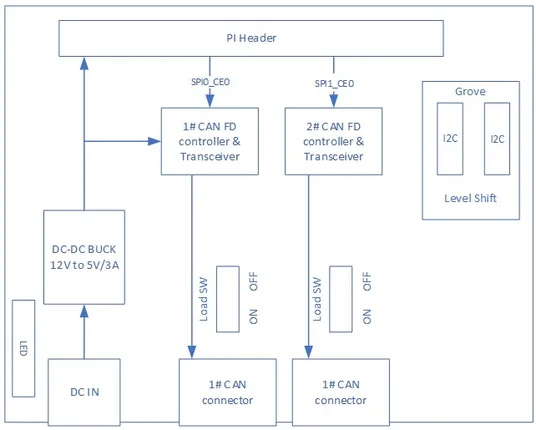
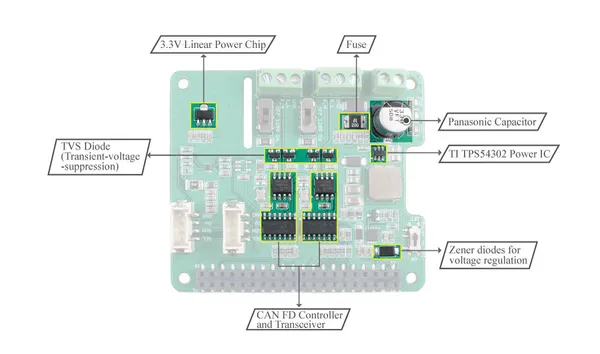
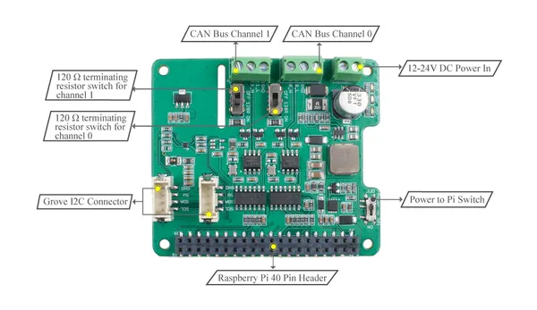
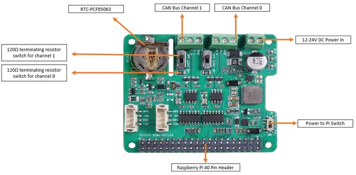

# 2-Channel CAN-BUS FD Shield for Raspberry Pi

**Seeed Studio** · Source collection

Revision: Unverified source identity  
Coverage: Source collection; review pending

[Browse all manufacturers](../../../../BROWSE.md) · [Desktop app](https://github.com/valleytechsolutions/black-wire-desktop)

## Block Diagram

**source reference** · Unreviewed source · JPG

[Open original reference](../../../../library/media/23a1c41a5bc742afd2dfa4a1b5814957cdee619f7cf272dff6eeb54060965750.jpg)

**Credit and rights:** Source rights not yet established. Source/manufacturer: Seeed Studio.

[Source 1](https://files.seeedstudio.com/wiki/2-Channel-CAN-BUS-FD-Shield-for-Raspberry-Pi/img/block-diagram.jpg) · [Source 2](https://wiki.seeedstudio.com/2-Channel-CAN-BUS-FD-Shield-for-Raspberry-Pi/)

Original source index: Block Diagram. This file is searchable but has not been promoted to a reviewed physical board pinout.

SHA-256: `23a1c41a5bc742afd2dfa4a1b5814957cdee619f7cf272dff6eeb54060965750`

## Hardware Overview 2

**source reference** · Unreviewed source · JPG

[Open original reference](../../../../library/media/b15c5d0c57fd8deb8d63b2987d3b7ed6646475e38428c60f62b438ba63426c35.jpg)

**Credit and rights:** Source rights not yet established. Source/manufacturer: Seeed Studio.

[Source 1](https://files.seeedstudio.com/wiki/2-Channel-CAN-BUS-FD-Shield-for-Raspberry-Pi/img/block2.jpg) · [Source 2](https://wiki.seeedstudio.com/2-Channel-CAN-BUS-FD-Shield-for-Raspberry-Pi/)

Original source index: Hardware Overview 2. This file is searchable but has not been promoted to a reviewed physical board pinout.

SHA-256: `b15c5d0c57fd8deb8d63b2987d3b7ed6646475e38428c60f62b438ba63426c35`

## Hardware Overview

**source reference** · Unreviewed source · JPG

[Open original reference](../../../../library/media/bdbcdf2094f3974b6a635d06b36c2346197fdfe8f05873ebaf65ad69c9061fc6.jpg)

**Credit and rights:** Source rights not yet established. Source/manufacturer: Seeed Studio.

[Source 1](https://files.seeedstudio.com/wiki/2-Channel-CAN-BUS-FD-Shield-for-Raspberry-Pi/img/block.jpg) · [Source 2](https://wiki.seeedstudio.com/2-Channel-CAN-BUS-FD-Shield-for-Raspberry-Pi/)

Original source index: Hardware Overview. This file is searchable but has not been promoted to a reviewed physical board pinout.

SHA-256: `bdbcdf2094f3974b6a635d06b36c2346197fdfe8f05873ebaf65ad69c9061fc6`

## Hardware Overview

**source reference** · Unreviewed source · PNG

[Open original reference](../../../../library/media/1b6a8b933dd55dc1e14d295e43c87f82de1171905cd1d547968fce3a23a9144f.png)

**Credit and rights:** Source rights not yet established. Source/manufacturer: Seeed Studio.

[Source 1](https://files.seeedstudio.com/wiki/CAN-BUS-FD/CANBUS_REVIEW.png) · [Source 2](https://wiki.seeedstudio.com/2-Channel-CAN-BUS-FD-Shield-for-Raspberry-Pi/)

Original source index: Hardware Overview. This file is searchable but has not been promoted to a reviewed physical board pinout.

SHA-256: `1b6a8b933dd55dc1e14d295e43c87f82de1171905cd1d547968fce3a23a9144f`

Pin assignments have not been independently electrically verified. Check board revision before wiring.
