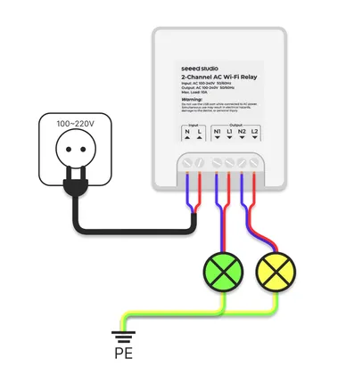

# 2-Channel Wi-Fi AC Relay Module

**Seeed Studio** · Source collection

Revision: Unverified source identity  
Coverage: Source collection; review pending

[Browse all manufacturers](../../../../BROWSE.md) · [Desktop app](https://github.com/valleytechsolutions/black-wire-desktop)

## Interfaces

**source reference** · Unreviewed source · PNG

[Open original reference](../../../../library/media/ec0a48cd1d1b18e78cbf49f6727eafca5fc82c4e199a7adcb2d1188c3dbefc49.png)

**Credit and rights:** Source rights not yet established. Source/manufacturer: Seeed Studio.

[Source 1](https://files.seeedstudio.com/wiki/XIAO/Gadgets/2_channel_ac_relay/relay_connections.png) · [Source 2](https://wiki.seeedstudio.com/2_channel_wifi_ac_relay/)

Original source index: Interfaces. This file is searchable but has not been promoted to a reviewed physical board pinout.

SHA-256: `ec0a48cd1d1b18e78cbf49f6727eafca5fc82c4e199a7adcb2d1188c3dbefc49`

Pin assignments have not been independently electrically verified. Check board revision before wiring.
