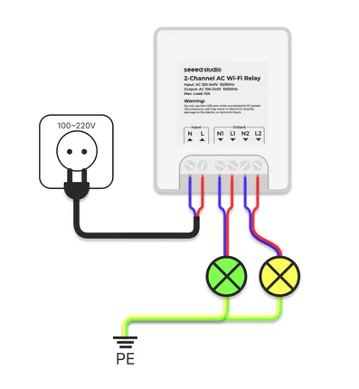

# 2-Channel Wi-Fi AC Relay Module

**Seeed Studio** · Source collection

Revision: Unverified source identity

Coverage: Source collection; review pending

[Browse all manufacturers](../../../../BROWSE.md) · [Devices & IoT](../../../../DEVICES.md) · [Open in the browser guide](https://valleytech-black-wire-guide.pages.dev/?board=source-board-237a8854b3461dfe7f)

## Datasheets and original documentation

Board datasheet: **not yet recorded**. Visual reference: **available**.

[Manufacturer source (recorded link)](https://wiki.seeedstudio.com/2_channel_wifi_ac_relay/)

A chip datasheet, schematic and board datasheet have different scopes. Match the exact hardware revision.

[Documentation coverage and remaining gaps](../../../../DOCUMENTATION.md)

## Interfaces

**source reference** · Unreviewed source · PNG

[Open original reference](../../../../library/media/ec0a48cd1d1b18e78cbf49f6727eafca5fc82c4e199a7adcb2d1188c3dbefc49.png)

**Credit and rights:** Source rights not yet established. Source/manufacturer: Seeed Studio.

[Source 1](https://files.seeedstudio.com/wiki/XIAO/Gadgets/2_channel_ac_relay/relay_connections.png) · [Source 2](https://wiki.seeedstudio.com/2_channel_wifi_ac_relay/)

Original source index: Interfaces. This file is searchable but has not been promoted to a reviewed physical board pinout.

Image revision: Not identified

SHA-256: `ec0a48cd1d1b18e78cbf49f6727eafca5fc82c4e199a7adcb2d1188c3dbefc49`

Pin assignments have not been independently electrically verified. Check board revision before wiring.
