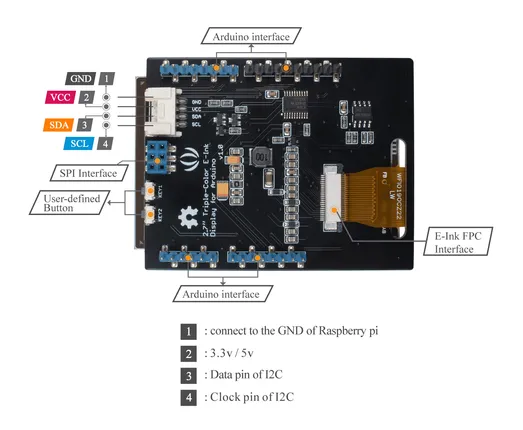

# 2.7inch Triple-Color E-Ink Shield for Arduino

**Seeed Studio** · Source collection

Revision: Unverified source identity  
Coverage: Source collection; review pending

[Browse all manufacturers](../../../../BROWSE.md) · [Desktop app](https://github.com/valleytechsolutions/black-wire-desktop)

## Hardware Overview

**source reference** · Unreviewed source · PNG

[Open original reference](../../../../library/media/58b45b94b2a0b202908823c9c65fcb1199a2a44c04df70e804966c9860679c69.png)

**Credit and rights:** Source rights not yet established. Source/manufacturer: Seeed Studio.

[Source 1](https://files.seeedstudio.com/wiki/2.7-Triple-Color-E-Ink-Shield-for-Arduino/img/hardware_overview.png) · [Source 2](https://wiki.seeedstudio.com/2.7inch-Triple-Color-E-Ink-Shield-for-Arduino/)

Original source index: Hardware Overview. This file is searchable but has not been promoted to a reviewed physical board pinout.

SHA-256: `58b45b94b2a0b202908823c9c65fcb1199a2a44c04df70e804966c9860679c69`

Pin assignments have not been independently electrically verified. Check board revision before wiring.
