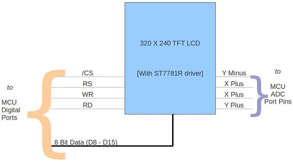

# 2.8inch TFT Touch Shield V1.0

**Seeed Studio** · Source collection

Revision: Unverified source identity  
Coverage: Source collection; review pending

[Browse all manufacturers](../../../../BROWSE.md) · [Desktop app](https://github.com/valleytechsolutions/black-wire-desktop)

## Block Diagram

**source reference** · Unreviewed source · JPG

[Open original reference](../../../../library/media/53b75ba940dcb17d740c8570cea7f55d2a113a5ec77fc33107d389e5125544cc.jpg)

**Credit and rights:** Source rights not yet established. Source/manufacturer: Seeed Studio.

[Source 1](https://files.seeedstudio.com/wiki/TFT_Touch_Shield_V1.0/img/2.8_Inch_TFT_Touch_Shield_Block_Diagram.jpg) · [Source 2](https://wiki.seeedstudio.com/TFT_Touch_Shield_V1.0/)

Original source index: Block Diagram. This file is searchable but has not been promoted to a reviewed physical board pinout.

SHA-256: `53b75ba940dcb17d740c8570cea7f55d2a113a5ec77fc33107d389e5125544cc`

Pin assignments have not been independently electrically verified. Check board revision before wiring.
