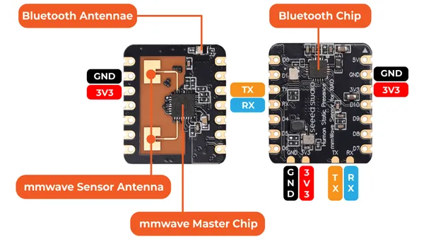

# 24GHz mmWave for XIAO

**Seeed Studio** · Source collection

Revision: Unverified source identity  
Coverage: Source collection; review pending

[Browse all manufacturers](../../../../BROWSE.md) · [Desktop app](https://github.com/valleytechsolutions/black-wire-desktop)

## Hardware Overview

**source reference** · Unreviewed source · PNG

[Open original reference](../../../../library/media/1ae5943dac898008d64e47a476b8749aa7293ea54f6213a9df3ba9397db25c22.png)

**Credit and rights:** Source rights not yet established. Source/manufacturer: Seeed Studio.

[Source 1](https://files.seeedstudio.com/wiki/mmwave-for-xiao/2.png) · [Source 2](https://wiki.seeedstudio.com/mmwave_for_xiao/)

Original source index: Hardware Overview. This file is searchable but has not been promoted to a reviewed physical board pinout.

SHA-256: `1ae5943dac898008d64e47a476b8749aa7293ea54f6213a9df3ba9397db25c22`

Pin assignments have not been independently electrically verified. Check board revision before wiring.
