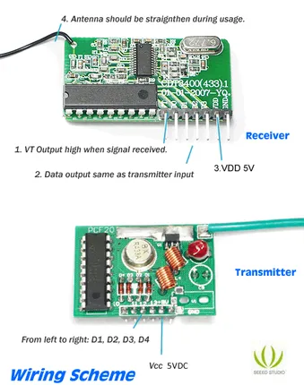
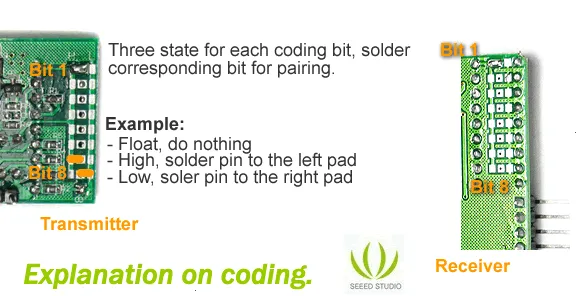

# 2KM Long Range RF Link Kit

**Seeed Studio** · Source collection

Revision: Unverified source identity  
Coverage: Source collection; review pending

[Browse all manufacturers](../../../../BROWSE.md) · [Desktop app](https://github.com/valleytechsolutions/black-wire-desktop)

## Hardware Overview

**source reference** · Unreviewed source · PNG

[Open original reference](../../../../library/media/a14eb8c20ea011b61f87e42cff4d531998264fa14cc2f0d7e5f6f7f193e3530c.png)

**Credit and rights:** Source rights not yet established. Source/manufacturer: Seeed Studio.

[Source 1](https://files.seeedstudio.com/wiki/2KM_Long_Range_RF_link_kits_w_encoder_and_decoder/img/433rf6.png) · [Source 2](https://wiki.seeedstudio.com/2KM_Long_Range_RF_link_kits_w_encoder_and_decoder/)

Original source index: Hardware Overview. This file is searchable but has not been promoted to a reviewed physical board pinout.

SHA-256: `a14eb8c20ea011b61f87e42cff4d531998264fa14cc2f0d7e5f6f7f193e3530c`

## Pin Functions

**source reference** · Unreviewed source · PNG

[Open original reference](../../../../library/media/8f4cc40f73f0eefb0dd3ae0dccd82064b917713fdba16145f2ff146a6eb4d129.png)

**Credit and rights:** Source rights not yet established. Source/manufacturer: Seeed Studio.

[Source 1](https://files.seeedstudio.com/wiki/2KM_Long_Range_RF_link_kits_w_encoder_and_decoder/img/433rf5.png) · [Source 2](https://wiki.seeedstudio.com/2KM_Long_Range_RF_link_kits_w_encoder_and_decoder/)

Original source index: Pin Functions. This file is searchable but has not been promoted to a reviewed physical board pinout.

SHA-256: `8f4cc40f73f0eefb0dd3ae0dccd82064b917713fdba16145f2ff146a6eb4d129`

Pin assignments have not been independently electrically verified. Check board revision before wiring.
