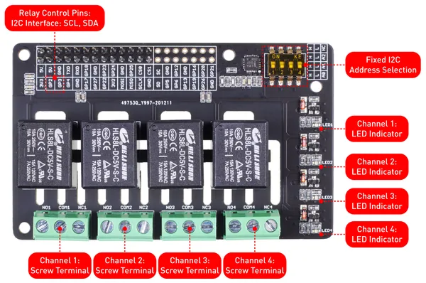

# 4-Channel SPDT Relay HAT for Raspberry Pi

**Seeed Studio** · Source collection

Revision: Unverified source identity  
Coverage: Source collection; review pending

[Browse all manufacturers](../../../../BROWSE.md) · [Desktop app](https://github.com/valleytechsolutions/black-wire-desktop)

## Hardware Overview

**source reference** · Unreviewed source · PNG

[Open original reference](../../../../library/media/11f735c1ff91869136ea4301ac98c7066390c9ee78c45fc65d296db5003517a2.png)

**Credit and rights:** Source rights not yet established. Source/manufacturer: Seeed Studio.

[Source 1](https://files.seeedstudio.com/wiki/Raspberry-Relay-Hat/2.png) · [Source 2](https://wiki.seeedstudio.com/Raspberry_Pi_Relay_Board_v1.0/)

Original source index: Hardware Overview. This file is searchable but has not been promoted to a reviewed physical board pinout.

SHA-256: `11f735c1ff91869136ea4301ac98c7066390c9ee78c45fc65d296db5003517a2`

Pin assignments have not been independently electrically verified. Check board revision before wiring.
