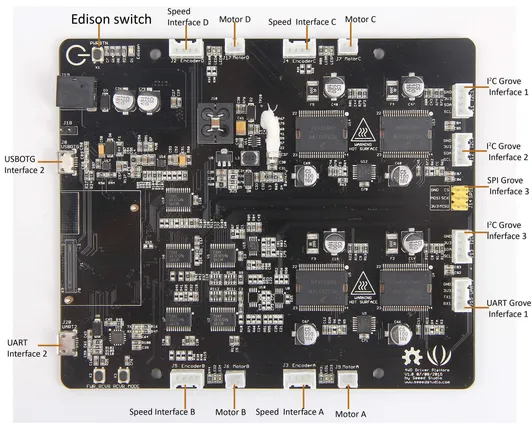

# 4WD Driver Platform V1.0

**Seeed Studio** · Source collection

Revision: Unverified source identity  
Coverage: Source collection; review pending

[Browse all manufacturers](../../../../BROWSE.md) · [Desktop app](https://github.com/valleytechsolutions/black-wire-desktop)

## Hardware Overview

**source reference** · Unreviewed source · JPG

[Open original reference](../../../../library/media/18381741a71df1e67ad16798cca9458c6cca66be0c20ec05f91361badc1fb025.jpg)

**Credit and rights:** Source rights not yet established. Source/manufacturer: Seeed Studio.

[Source 1](https://files.seeedstudio.com/wiki/4WD_Driver_Platform_V1.0/img/4WD_Driver_Platform_V1.0_3400_Modules.jpg) · [Source 2](https://wiki.seeedstudio.com/4WD_Driver_Platform_V1.0/)

Original source index: Hardware Overview. This file is searchable but has not been promoted to a reviewed physical board pinout.

SHA-256: `18381741a71df1e67ad16798cca9458c6cca66be0c20ec05f91361badc1fb025`

Pin assignments have not been independently electrically verified. Check board revision before wiring.
