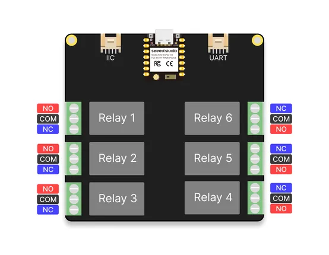

# 6-Channel Wi-Fi Relay Module

**Seeed Studio** · Source collection

Revision: Unverified source identity  
Coverage: Source collection; review pending

[Browse all manufacturers](../../../../BROWSE.md) · [Desktop app](https://github.com/valleytechsolutions/black-wire-desktop)

## Hardware Overview

**source reference** · Unreviewed source · PNG

[Open original reference](../../../../library/media/a0078c473a30e17bd270a934933d7a3486add828fba84f6513958b880c96e753.png)

**Credit and rights:** Source rights not yet established. Source/manufacturer: Seeed Studio.

[Source 1](https://files.seeedstudio.com/wiki/XIAO/Gadgets/6_channel_wifi_relay/simplified_diagram_with_con.png) · [Source 2](https://wiki.seeedstudio.com/6_channel_wifi_relay/)

Original source index: Hardware Overview. This file is searchable but has not been promoted to a reviewed physical board pinout.

SHA-256: `a0078c473a30e17bd270a934933d7a3486add828fba84f6513958b880c96e753`

Pin assignments have not been independently electrically verified. Check board revision before wiring.
