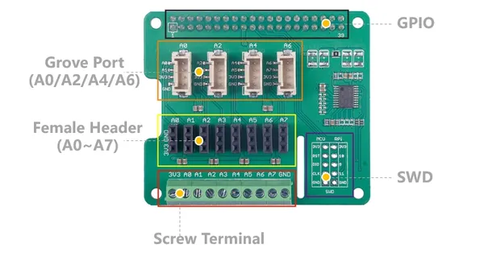

# 8-Channel 12-Bit ADC for Raspberry Pi (STM32F030)

**Seeed Studio** · Source collection

Revision: Unverified source identity  
Coverage: Source collection; review pending

[Browse all manufacturers](../../../../BROWSE.md) · [Desktop app](https://github.com/valleytechsolutions/black-wire-desktop)

## Hardware Overview

**source reference** · Unreviewed source · JPG

[Open original reference](../../../../library/media/63310a3b2dfaa33554096d3aa58b47e6c38e225cd8044f606cb982c49130322d.jpg)

**Credit and rights:** Source rights not yet established. Source/manufacturer: Seeed Studio.

[Source 1](https://files.seeedstudio.com/wiki/8-Channel_12-Bit_ADC_for_Raspberry_Pi-STM32F030/img/280-pin.jpg) · [Source 2](https://wiki.seeedstudio.com/8-Channel_12-Bit_ADC_for_Raspberry_Pi-STM32F030/)

Original source index: Hardware Overview. This file is searchable but has not been promoted to a reviewed physical board pinout.

SHA-256: `63310a3b2dfaa33554096d3aa58b47e6c38e225cd8044f606cb982c49130322d`

Pin assignments have not been independently electrically verified. Check board revision before wiring.
