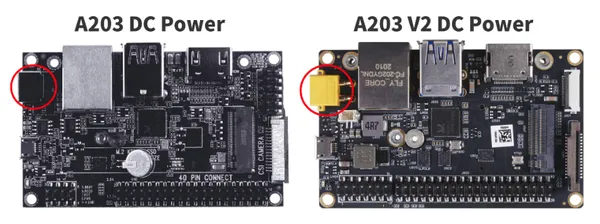
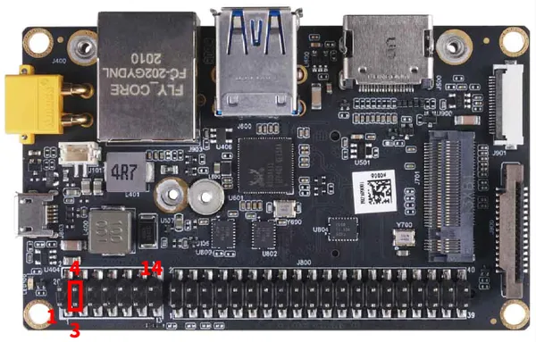
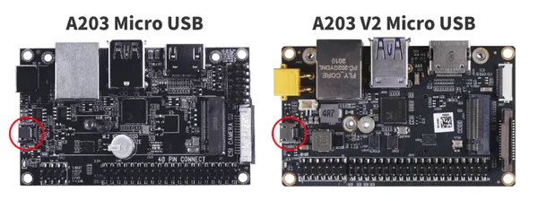
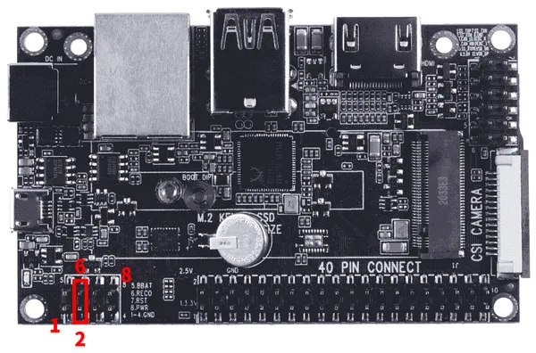

# A203 Carrier Board

**Seeed Studio** · Source collection

Revision: Unverified source identity  
Coverage: Source collection; review pending

[Browse all manufacturers](../../../../BROWSE.md) · [Desktop app](https://github.com/valleytechsolutions/black-wire-desktop)

## Hardware Overview 2

**source reference** · Unreviewed source · JPG

[Open original reference](../../../../library/media/4abdbfe52e68c7b9a8f7a4c2b91b9bbb765cf595b191adc6b87a87354890cc5e.jpg)

**Credit and rights:** Source rights not yet established. Source/manufacturer: Seeed Studio.

[Source 1](https://files.seeedstudio.com/wiki/reComputer_Carrier_Board/A203/Flash_A2033.jpg) · [Source 2](https://wiki.seeedstudio.com/reComputer_A203_Flash_System/)

Original source index: Hardware Overview 2. This file is searchable but has not been promoted to a reviewed physical board pinout.

SHA-256: `4abdbfe52e68c7b9a8f7a4c2b91b9bbb765cf595b191adc6b87a87354890cc5e`

## Hardware Overview 2

**source reference** · Unreviewed source · PNG

[Open original reference](../../../../library/media/8d983e0d721dddb42d6823b9e3a1bd09c230e3848b2858c699191db82efc197d.png)

**Credit and rights:** Source rights not yet established. Source/manufacturer: Seeed Studio.

[Source 1](https://files.seeedstudio.com/wiki/A20X/A203V2.png) · [Source 2](https://wiki.seeedstudio.com/reComputer_A203_Flash_System/)

Original source index: Hardware Overview 2. This file is searchable but has not been promoted to a reviewed physical board pinout.

SHA-256: `8d983e0d721dddb42d6823b9e3a1bd09c230e3848b2858c699191db82efc197d`

## Hardware Overview

**source reference** · Unreviewed source · JPG

[Open original reference](../../../../library/media/beec7755dfa13789bf520c6b9dd06f72235512c4e761bbb0c97cd836c38814c9.jpg)

**Credit and rights:** Source rights not yet established. Source/manufacturer: Seeed Studio.

[Source 1](https://files.seeedstudio.com/wiki/reComputer_Carrier_Board/A203/Flash_A2032.jpg) · [Source 2](https://wiki.seeedstudio.com/reComputer_A203_Flash_System/)

Original source index: Hardware Overview. This file is searchable but has not been promoted to a reviewed physical board pinout.

SHA-256: `beec7755dfa13789bf520c6b9dd06f72235512c4e761bbb0c97cd836c38814c9`

## Hardware Overview

**source reference** · Unreviewed source · PNG

[Open original reference](../../../../library/media/be727e4547105547e492d1a4c7d0a35ca19ed979a07691fe6c25f6a905b4d4c2.png)

**Credit and rights:** Source rights not yet established. Source/manufacturer: Seeed Studio.

[Source 1](https://files.seeedstudio.com/wiki/A20X/A203.png) · [Source 2](https://wiki.seeedstudio.com/reComputer_A203_Flash_System/)

Original source index: Hardware Overview. This file is searchable but has not been promoted to a reviewed physical board pinout.

SHA-256: `be727e4547105547e492d1a4c7d0a35ca19ed979a07691fe6c25f6a905b4d4c2`

## Pin Definition 2

**source reference** · Unreviewed source · PDF

[Open original reference](../../../../library/media/b25c42c01a188eeafeaf91a08d3aa9ebef9e0377d5bf2f0f15baecae6c6f69b9.pdf)

**Credit and rights:** Source rights not yet established. Source/manufacturer: Seeed Studio.

[Source 1](https://files.seeedstudio.com/products/103110043/A203%20V2%20pin%20description.pdf) · [Source 2](https://wiki.seeedstudio.com/reComputer_A203_Flash_System/)

Original source index: Pin Definition 2. This file is searchable but has not been promoted to a reviewed physical board pinout.

SHA-256: `b25c42c01a188eeafeaf91a08d3aa9ebef9e0377d5bf2f0f15baecae6c6f69b9`

## Pin Definition

**source reference** · Unreviewed source · PDF

[Open original reference](../../../../library/media/9ed1b1a67d887684e1a8e678d0726f5df647372425d79a7f00fe2e2c2dd36a74.pdf)

**Credit and rights:** Source rights not yet established. Source/manufacturer: Seeed Studio.

[Source 1](https://files.seeedstudio.com/products/114110047/A203_Pin_Description.pdf) · [Source 2](https://wiki.seeedstudio.com/reComputer_A203_Flash_System/)

Original source index: Pin Definition. This file is searchable but has not been promoted to a reviewed physical board pinout.

SHA-256: `9ed1b1a67d887684e1a8e678d0726f5df647372425d79a7f00fe2e2c2dd36a74`

Pin assignments have not been independently electrically verified. Check board revision before wiring.
