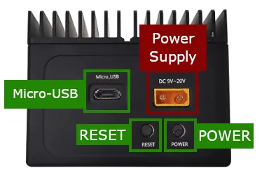

# A203E Mini PC

**Seeed Studio** · Source collection

Revision: Unverified source identity  
Coverage: Source collection; review pending

[Browse all manufacturers](../../../../BROWSE.md) · [Desktop app](https://github.com/valleytechsolutions/black-wire-desktop)

## Interfaces

**source reference** · Unreviewed source · PNG

[Open original reference](../../../../library/media/3a1a38f51f12dad6c0935609a6f36f75081641be45cf908bd44ba19f901ce9ee.png)

**Credit and rights:** Source rights not yet established. Source/manufacturer: Seeed Studio.

[Source 1](https://files.seeedstudio.com/wiki/A203E/a203E_interface.png) · [Source 2](https://wiki.seeedstudio.com/reComputer_A203E_Flash_System/)

Original source index: Interfaces. This file is searchable but has not been promoted to a reviewed physical board pinout.

SHA-256: `3a1a38f51f12dad6c0935609a6f36f75081641be45cf908bd44ba19f901ce9ee`

Pin assignments have not been independently electrically verified. Check board revision before wiring.
