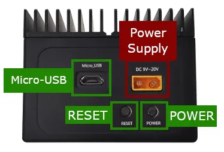

# A203E Mini PC

**Seeed Studio** · Source collection

Revision: Unverified source identity

Coverage: Source collection; review pending

[Browse all manufacturers](../../../../BROWSE.md) · [Devices & IoT](../../../../DEVICES.md) · [Open in the browser guide](https://valleytech-black-wire-guide.pages.dev/?board=source-board-b2530201efa3873193)

## Datasheets and original documentation

Board datasheet: **not yet recorded**. Visual reference: **available**.

[Manufacturer source (recorded link)](https://wiki.seeedstudio.com/reComputer_A203E_Flash_System/)

A chip datasheet, schematic and board datasheet have different scopes. Match the exact hardware revision.

[Documentation coverage and remaining gaps](../../../../DOCUMENTATION.md)

## Interfaces

**source reference** · Unreviewed source · PNG

[Open original reference](../../../../library/media/3a1a38f51f12dad6c0935609a6f36f75081641be45cf908bd44ba19f901ce9ee.png)

**Credit and rights:** Source rights not yet established. Source/manufacturer: Seeed Studio.

[Source 1](https://files.seeedstudio.com/wiki/A203E/a203E_interface.png) · [Source 2](https://wiki.seeedstudio.com/reComputer_A203E_Flash_System/)

Original source index: Interfaces. This file is searchable but has not been promoted to a reviewed physical board pinout.

Image revision: Not identified

SHA-256: `3a1a38f51f12dad6c0935609a6f36f75081641be45cf908bd44ba19f901ce9ee`

Pin assignments have not been independently electrically verified. Check board revision before wiring.
