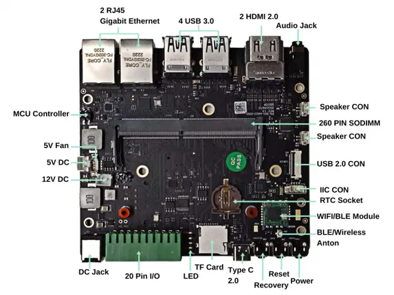

# A205E Carrier Board

**Seeed Studio** · Source collection

Revision: Unverified source identity  
Coverage: Source collection; review pending

[Browse all manufacturers](../../../../BROWSE.md) · [Desktop app](https://github.com/valleytechsolutions/black-wire-desktop)

## Hardware Overview

**source reference** · Unreviewed source · PNG

[Open original reference](../../../../library/media/6480702de4a4bfa1782ff7f73612d07745cb20838d0a0c138b36a4e68e560a88.png)

**Credit and rights:** Source rights not yet established. Source/manufacturer: Seeed Studio.

[Source 1](https://media-cdn.seeedstudio.com/media/catalog/product/cache/b5e839932a12c6938f4f9ff16fa3726a/a/n/antenna_dc_jack_io_controller_20_pin_1_.png) · [Source 2](https://wiki.seeedstudio.com/reComputer_A205E_Flash_System/)

Original source index: Hardware Overview. This file is searchable but has not been promoted to a reviewed physical board pinout.

SHA-256: `6480702de4a4bfa1782ff7f73612d07745cb20838d0a0c138b36a4e68e560a88`

Pin assignments have not been independently electrically verified. Check board revision before wiring.
