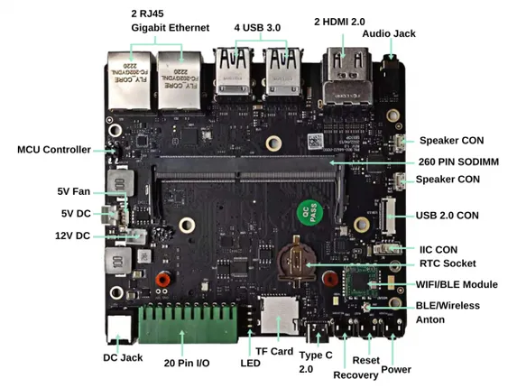

# A205E Carrier Board

**Seeed Studio** · Source collection

Revision: Unverified source identity

Coverage: Source collection; review pending

[Browse all manufacturers](../../../../BROWSE.md) · [Devices & IoT](../../../../DEVICES.md) · [Open in the browser guide](https://valleytech-black-wire-guide.pages.dev/?board=source-board-898e4bd259b43937dd)

## Datasheets and original documentation

Board datasheet: **not yet recorded**. Visual reference: **available**.

[Manufacturer source (recorded link)](https://wiki.seeedstudio.com/reComputer_A205E_Flash_System/)

A chip datasheet, schematic and board datasheet have different scopes. Match the exact hardware revision.

[Documentation coverage and remaining gaps](../../../../DOCUMENTATION.md)

## Hardware Overview

**source reference** · Unreviewed source · PNG

[Open original reference](../../../../library/media/6480702de4a4bfa1782ff7f73612d07745cb20838d0a0c138b36a4e68e560a88.png)

**Credit and rights:** Source rights not yet established. Source/manufacturer: Seeed Studio.

[Source 1](https://media-cdn.seeedstudio.com/media/catalog/product/cache/b5e839932a12c6938f4f9ff16fa3726a/a/n/antenna_dc_jack_io_controller_20_pin_1_.png) · [Source 2](https://wiki.seeedstudio.com/reComputer_A205E_Flash_System/)

Original source index: Hardware Overview. This file is searchable but has not been promoted to a reviewed physical board pinout.

Image revision: Not identified

SHA-256: `6480702de4a4bfa1782ff7f73612d07745cb20838d0a0c138b36a4e68e560a88`

Pin assignments have not been independently electrically verified. Check board revision before wiring.
