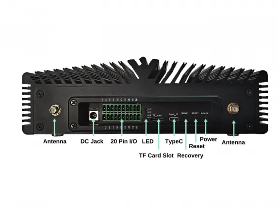

# A205E Mini PC

**Seeed Studio** · Source collection

Revision: Unverified source identity  
Coverage: Source collection; review pending

[Browse all manufacturers](../../../../BROWSE.md) · [Desktop app](https://github.com/valleytechsolutions/black-wire-desktop)

## Hardware Overview

**source reference** · Unreviewed source · PNG

[Open original reference](../../../../library/media/9c4e42387f388f76bfa62927a1baf63292ca3e519339ccc462d4df5364a538b1.png)

**Credit and rights:** Source rights not yet established. Source/manufacturer: Seeed Studio.

[Source 1](https://media-cdn.seeedstudio.com/media/catalog/product/cache/b5e839932a12c6938f4f9ff16fa3726a/2/_/2_8_3.png) · [Source 2](https://wiki.seeedstudio.com/reComputer_A205E_Flash_System/)

Original source index: Hardware Overview. This file is searchable but has not been promoted to a reviewed physical board pinout.

SHA-256: `9c4e42387f388f76bfa62927a1baf63292ca3e519339ccc462d4df5364a538b1`

Pin assignments have not been independently electrically verified. Check board revision before wiring.
