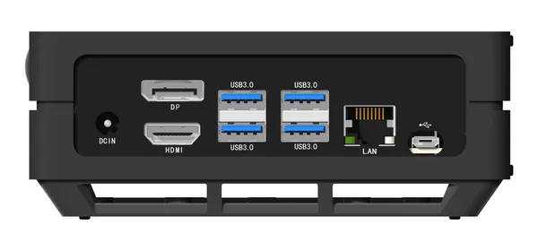
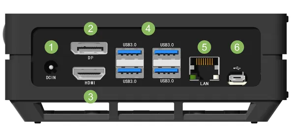
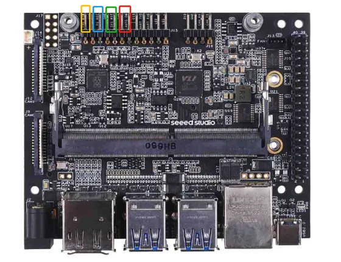

# A206 Carrier Board

**Seeed Studio** · Source collection

Revision: Unverified source identity  
Coverage: Source collection; review pending

[Browse all manufacturers](../../../../BROWSE.md) · [Desktop app](https://github.com/valleytechsolutions/black-wire-desktop)

## Hardware Overview (Back)

**source reference** · Unreviewed source · PNG

[Open original reference](../../../../library/media/9d0bdce2b4c0abbc782e40ff1e3b9c3d6e1162e3f5179e2a1db1c499cc463ff6.png)

**Credit and rights:** Source rights not yet established. Source/manufacturer: Seeed Studio.

[Source 1](https://files.seeedstudio.com/wiki/recomputer-Jetson-20-1-H1/frontview5.png) · [Source 2](https://wiki.seeedstudio.com/reComputer_Jetson_Series_Introduction/)

Original source index: Hardware Overview (Back). This file is searchable but has not been promoted to a reviewed physical board pinout.

SHA-256: `9d0bdce2b4c0abbc782e40ff1e3b9c3d6e1162e3f5179e2a1db1c499cc463ff6`

## Hardware Overview (Ports)

**source reference** · Unreviewed source · PNG

[Open original reference](../../../../library/media/62b863bc813b0cf1d2aa77c7a83303899346635de55b6bbe64fb8820a3dd98b4.png)

**Credit and rights:** Source rights not yet established. Source/manufacturer: Seeed Studio.

[Source 1](https://files.seeedstudio.com/wiki/recomputer-Jetson-20-1-H1/jetson-h01mark.png) · [Source 2](https://wiki.seeedstudio.com/reComputer_Jetson_Series_Introduction/)

Original source index: Hardware Overview (Ports). This file is searchable but has not been promoted to a reviewed physical board pinout.

SHA-256: `62b863bc813b0cf1d2aa77c7a83303899346635de55b6bbe64fb8820a3dd98b4`

## Hardware Overview (Top)

**source reference** · Unreviewed source · PNG

[Open original reference](../../../../library/media/8f41f85b5cede887df18e7fd0308f15d55ff139105e0c4c6ed3fd25dd40144e9.png)

**Credit and rights:** Source rights not yet established. Source/manufacturer: Seeed Studio.

[Source 1](https://files.seeedstudio.com/wiki/reComputer-Jetson-Nano/J202-b.png) · [Source 2](https://wiki.seeedstudio.com/reComputer_J1020_A206_Flash_JetPack/)

Original source index: Hardware Overview (Top). This file is searchable but has not been promoted to a reviewed physical board pinout.

SHA-256: `8f41f85b5cede887df18e7fd0308f15d55ff139105e0c4c6ed3fd25dd40144e9`

## Pin Definition

**source reference** · Unreviewed source · PDF

[Open original reference](../../../../library/media/5662324ce759e1a4043775e89f8a7f65971b8f0efb745e4e2c67b9eb1a36f832.pdf)

**Credit and rights:** Source rights not yet established. Source/manufacturer: Seeed Studio.

[Source 1](https://files.seeedstudio.com/wiki/reComputer-Jetson/reComputer-Jetson-J1020-w_o-power-adapter-datasheet.pdf) · [Source 2](https://wiki.seeedstudio.com/reComputer_J1020_A206_Flash_JetPack/)

Original source index: Pin Definition. This file is searchable but has not been promoted to a reviewed physical board pinout.

SHA-256: `5662324ce759e1a4043775e89f8a7f65971b8f0efb745e4e2c67b9eb1a36f832`

Pin assignments have not been independently electrically verified. Check board revision before wiring.
