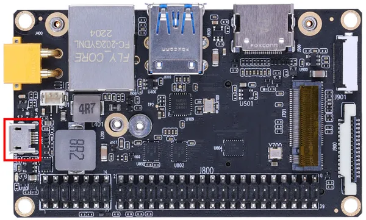

# A603 Carrier Board

**Seeed Studio** · Source collection

Revision: Unverified source identity  
Coverage: Source collection; review pending

[Browse all manufacturers](../../../../BROWSE.md) · [Desktop app](https://github.com/valleytechsolutions/black-wire-desktop)

## Hardware Overview (Top)

**source reference** · Unreviewed source · JPG

[Open original reference](../../../../library/media/1986964b0ecfa03c962999406722a65086a838b679b38b99e58fa3ba89be01b9.jpg)

**Credit and rights:** Source rights not yet established. Source/manufacturer: Seeed Studio.

[Source 1](https://files.seeedstudio.com/wiki/A603/2.jpg) · [Source 2](https://wiki.seeedstudio.com/reComputer_A603_Flash_System/)

Original source index: Hardware Overview (Top). This file is searchable but has not been promoted to a reviewed physical board pinout.

SHA-256: `1986964b0ecfa03c962999406722a65086a838b679b38b99e58fa3ba89be01b9`

Pin assignments have not been independently electrically verified. Check board revision before wiring.
