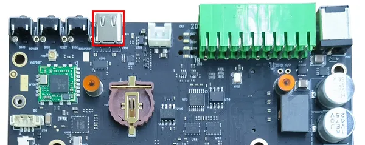

# A607 Carrier Board

**Seeed Studio** · Source collection

Revision: Unverified source identity  
Coverage: Source collection; review pending

[Browse all manufacturers](../../../../BROWSE.md) · [Desktop app](https://github.com/valleytechsolutions/black-wire-desktop)

## Hardware Overview (Top)

**source reference** · Unreviewed source · PNG

[Open original reference](../../../../library/media/d45095f48d74e4017d2ee92e82172af7a9da6083c2d5b2fd5c59f072f95ccf61.png)

**Credit and rights:** Source rights not yet established. Source/manufacturer: Seeed Studio.

[Source 1](https://files.seeedstudio.com/wiki/A607/3.png) · [Source 2](https://wiki.seeedstudio.com/reComputer_A607_Flash_System/)

Original source index: Hardware Overview (Top). This file is searchable but has not been promoted to a reviewed physical board pinout.

SHA-256: `d45095f48d74e4017d2ee92e82172af7a9da6083c2d5b2fd5c59f072f95ccf61`

Pin assignments have not been independently electrically verified. Check board revision before wiring.
