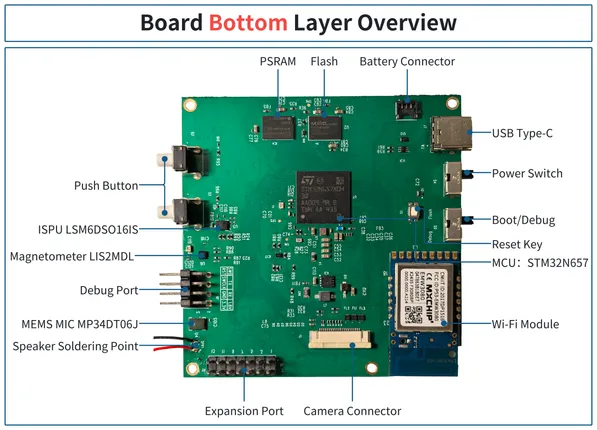
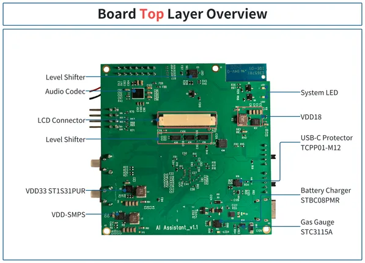
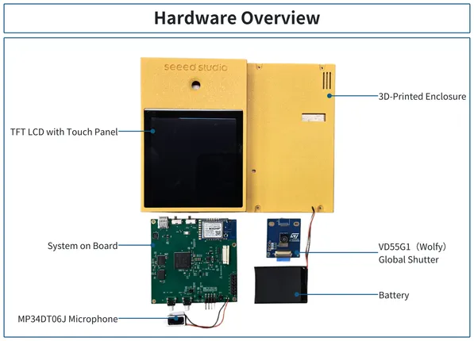

# AI Assistant (STM32N657)

**Seeed Studio** · Source collection

Revision: Unverified source identity  
Coverage: Source collection; review pending

[Browse all manufacturers](../../../../BROWSE.md) · [Desktop app](https://github.com/valleytechsolutions/black-wire-desktop)

## Hardware Overview (Bottom)

**source reference** · Unreviewed source · PNG

[Open original reference](../../../../library/media/359a9ab0c278895ec05fea11a2ce234a6a9ac46b4e0591d0fa8e8677be4e2c4c.png)

**Credit and rights:** Source rights not yet established. Source/manufacturer: Seeed Studio.

[Source 1](https://files.seeedstudio.com/wiki/AI_Assistant_V1.1/img/Bottom.png) · [Source 2](https://wiki.seeedstudio.com/ai_assistant_getting_started/)

Original source index: Hardware Overview (Bottom). This file is searchable but has not been promoted to a reviewed physical board pinout.

SHA-256: `359a9ab0c278895ec05fea11a2ce234a6a9ac46b4e0591d0fa8e8677be4e2c4c`

## Hardware Overview (Top)

**source reference** · Unreviewed source · PNG

[Open original reference](../../../../library/media/9dfbfe94889a79f5b776d0112eac8d1f03dabf13d4082c6a0139f74e09fdfb77.png)

**Credit and rights:** Source rights not yet established. Source/manufacturer: Seeed Studio.

[Source 1](https://files.seeedstudio.com/wiki/AI_Assistant_V1.1/img/Top.png) · [Source 2](https://wiki.seeedstudio.com/ai_assistant_getting_started/)

Original source index: Hardware Overview (Top). This file is searchable but has not been promoted to a reviewed physical board pinout.

SHA-256: `9dfbfe94889a79f5b776d0112eac8d1f03dabf13d4082c6a0139f74e09fdfb77`

## Hardware Overview

**source reference** · Unreviewed source · PNG

[Open original reference](../../../../library/media/16e93d3966db915411a6c29139e9ec30af7d685170661aa8a0343bc42578ecd5.png)

**Credit and rights:** Source rights not yet established. Source/manufacturer: Seeed Studio.

[Source 1](https://files.seeedstudio.com/wiki/AI_Assistant_V1.1/img/Hardware_Overview.png) · [Source 2](https://wiki.seeedstudio.com/ai_assistant_getting_started/)

Original source index: Hardware Overview. This file is searchable but has not been promoted to a reviewed physical board pinout.

SHA-256: `16e93d3966db915411a6c29139e9ec30af7d685170661aa8a0343bc42578ecd5`

Pin assignments have not been independently electrically verified. Check board revision before wiring.
