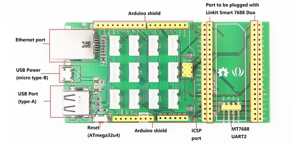

# Arduino Breakout for LinkIt Smart 7688 Duo

**Seeed Studio** · Source collection

Revision: Unverified source identity  
Coverage: Source collection; review pending

[Browse all manufacturers](../../../../BROWSE.md) · [Desktop app](https://github.com/valleytechsolutions/black-wire-desktop)

## Hardware Overview

**source reference** · Unreviewed source · JPG

[Open original reference](../../../../library/media/207120e1020b828b0b370385ed26f975b8b113b0ce2d5ba466133639e2db6aa2.jpg)

**Credit and rights:** Source rights not yet established. Source/manufacturer: Seeed Studio.

[Source 1](https://files.seeedstudio.com/wiki/Arduino_Breakout_for_LinkIt_Smart_7688_Duo/images/Arduino_Breakout_for_LinkIt_Smart_7688_Duo_components_with_text_1200_s.jpg) · [Source 2](https://wiki.seeedstudio.com/Arduino_Breakout_for_LinkIt_Smart_7688_Duo/)

Original source index: Hardware Overview. This file is searchable but has not been promoted to a reviewed physical board pinout.

SHA-256: `207120e1020b828b0b370385ed26f975b8b113b0ce2d5ba466133639e2db6aa2`

Pin assignments have not been independently electrically verified. Check board revision before wiring.
