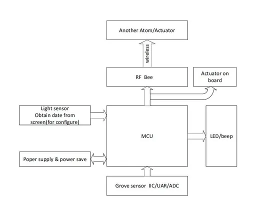
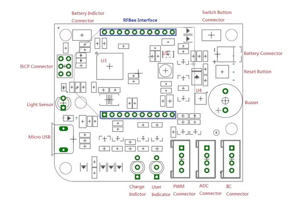

# Atom Node

**Seeed Studio** · Source collection

Revision: Unverified source identity  
Coverage: Source collection; review pending

[Browse all manufacturers](../../../../BROWSE.md) · [Desktop app](https://github.com/valleytechsolutions/black-wire-desktop)

## Block Diagram

**source reference** · Unreviewed source · JPG

[Open original reference](../../../../library/media/150a80601f902be38d080bf7d04f27573525cada28be04e24982630ea73ed959.jpg)

**Credit and rights:** Source rights not yet established. Source/manufacturer: Seeed Studio.

[Source 1](https://files.seeedstudio.com/wiki/Atom_Node/img/Beacon_ATOM_hardware.jpg) · [Source 2](https://wiki.seeedstudio.com/Atom_Node/)

Original source index: Block Diagram. This file is searchable but has not been promoted to a reviewed physical board pinout.

SHA-256: `150a80601f902be38d080bf7d04f27573525cada28be04e24982630ea73ed959`

## Hardware Overview

**source reference** · Unreviewed source · JPG

[Open original reference](../../../../library/media/8d4b1e0907883c48844dfa4fde4c7a186111537db2d42b0dc37e5315d4e9414e.jpg)

**Credit and rights:** Source rights not yet established. Source/manufacturer: Seeed Studio.

[Source 1](https://files.seeedstudio.com/wiki/Atom_Node/img/Atom_Node_Interface_Function.jpg) · [Source 2](https://wiki.seeedstudio.com/Atom_Node/)

Original source index: Hardware Overview. This file is searchable but has not been promoted to a reviewed physical board pinout.

SHA-256: `8d4b1e0907883c48844dfa4fde4c7a186111537db2d42b0dc37e5315d4e9414e`

Pin assignments have not been independently electrically verified. Check board revision before wiring.
