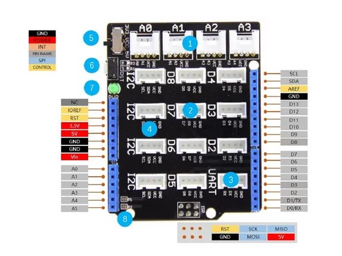
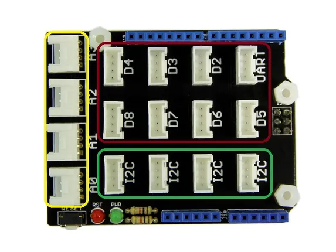

# Base Shield V2

**Seeed Studio** · Source collection

Revision: Unverified source identity  
Coverage: Source collection; review pending

[Browse all manufacturers](../../../../BROWSE.md) · [Desktop app](https://github.com/valleytechsolutions/black-wire-desktop)

## Hardware Overview

**source reference** · Unreviewed source · JPG

[Open original reference](../../../../library/media/c21d3a39f21a18ed036386b4c0d0d67f85f67f9f2c0e5772212ed4a6ef1b5111.jpg)

**Credit and rights:** Source rights not yet established. Source/manufacturer: Seeed Studio.

[Source 1](https://files.seeedstudio.com/wiki/Base_Shield_V2/img/hardware_overview.jpg) · [Source 2](https://wiki.seeedstudio.com/Base_Shield_V2/)

Original source index: Hardware Overview. This file is searchable but has not been promoted to a reviewed physical board pinout.

SHA-256: `c21d3a39f21a18ed036386b4c0d0d67f85f67f9f2c0e5772212ed4a6ef1b5111`

## Interfaces

**source reference** · Unreviewed source · JPG

[Open original reference](../../../../library/media/3ac9a0f5556c1b98c9ea60f79e751ed9af9936fca6064c13ffbd91f72f60346c.jpg)

**Credit and rights:** Source rights not yet established. Source/manufacturer: Seeed Studio.

[Source 1](https://files.seeedstudio.com/wiki/Grove_Starter_Kit_Plus/img/Grove-base_shield_v1.3.jpeg) · [Source 2](https://wiki.seeedstudio.com/Grove_Starter_Kit_Plus/)

Original source index: Interfaces. This file is searchable but has not been promoted to a reviewed physical board pinout.

SHA-256: `3ac9a0f5556c1b98c9ea60f79e751ed9af9936fca6064c13ffbd91f72f60346c`

Pin assignments have not been independently electrically verified. Check board revision before wiring.
