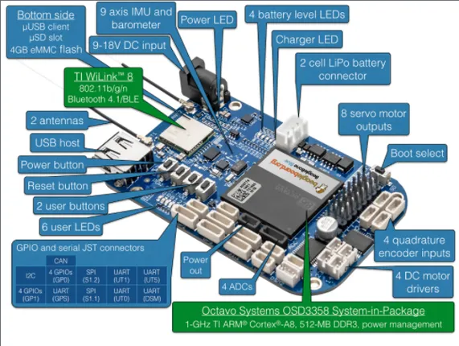

# BeagleBone Blue

**Seeed Studio** · Source collection

Revision: Unverified source identity  
Coverage: Source collection; review pending

[Browse all manufacturers](../../../../BROWSE.md) · [Desktop app](https://github.com/valleytechsolutions/black-wire-desktop)

## Hardware Overview

**source reference** · Unreviewed source · PNG

[Open original reference](../../../../library/media/b732ff71fd9ce1dfca5fa6fb76447a2bd15310dcb1f08de9aef3401352db94b1.png)

**Credit and rights:** Source rights not yet established. Source/manufacturer: Seeed Studio.

[Source 1](https://github.com/SeeedDocument/Beaglebone_Blue/raw/master/img/Hardware_overviw.png) · [Source 2](https://wiki.seeedstudio.com/BeagleBone_Blue/)

Original source index: Hardware Overview. This file is searchable but has not been promoted to a reviewed physical board pinout.

SHA-256: `b732ff71fd9ce1dfca5fa6fb76447a2bd15310dcb1f08de9aef3401352db94b1`

Pin assignments have not been independently electrically verified. Check board revision before wiring.
