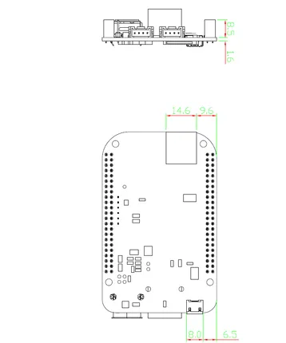
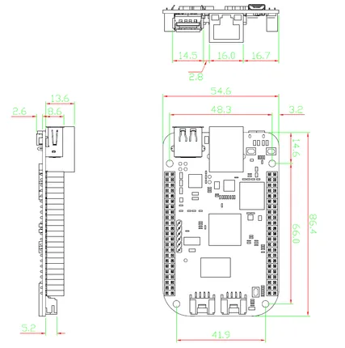
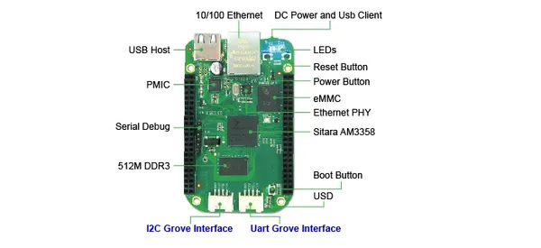
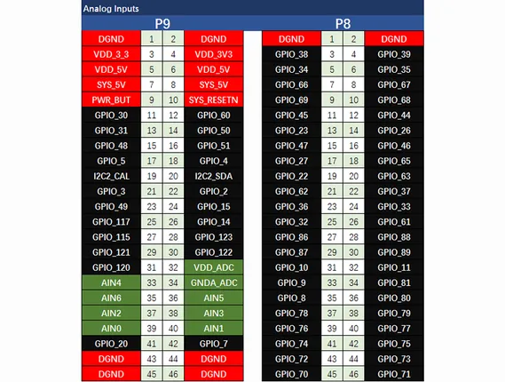
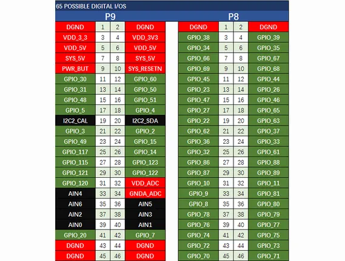
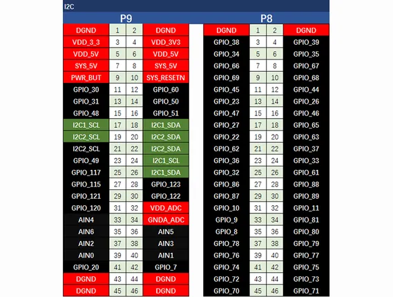
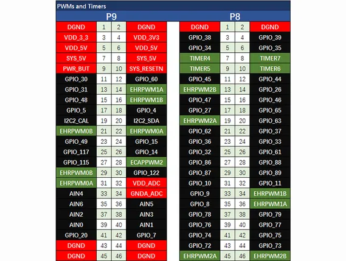
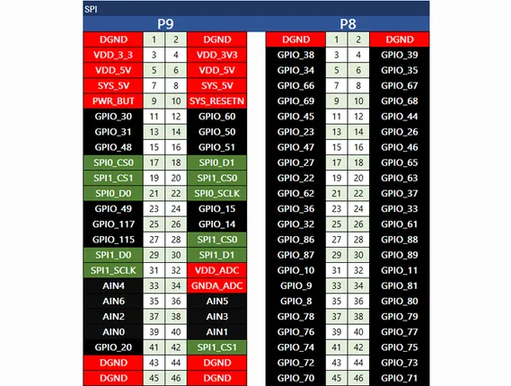
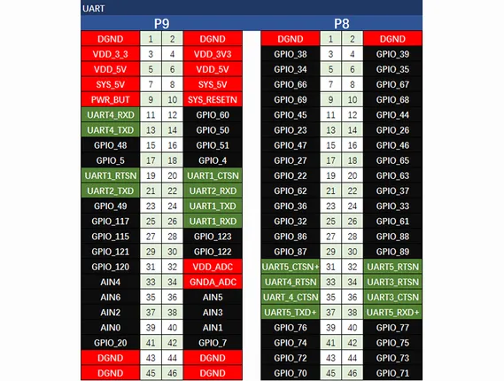

# BeagleBone Green

**Seeed Studio** · Source collection

Revision: Unverified source identity  
Coverage: Source collection; review pending

[Browse all manufacturers](../../../../BROWSE.md) · [Desktop app](https://github.com/valleytechsolutions/black-wire-desktop)

## Dimensions 2

**source reference** · Unreviewed source · PNG

[Open original reference](../../../../library/media/d93cafce3ddb49696559ff04059bf4a4974201b129fb4d6ae8568830b2e84f2d.png)

**Credit and rights:** Source rights not yet established. Source/manufacturer: Seeed Studio.

[Source 1](https://files.seeedstudio.com/wiki/BeagleBone_Green/images/BBG_drawing_2.png) · [Source 2](https://wiki.seeedstudio.com/BeagleBone_Green/)

Original source index: Dimensions 2. This file is searchable but has not been promoted to a reviewed physical board pinout.

SHA-256: `d93cafce3ddb49696559ff04059bf4a4974201b129fb4d6ae8568830b2e84f2d`

## Dimensions

**source reference** · Unreviewed source · PNG

[Open original reference](../../../../library/media/322744c216459c97e008c244640a1668c9cd23a40200d6a115b5db1fca4e1d90.png)

**Credit and rights:** Source rights not yet established. Source/manufacturer: Seeed Studio.

[Source 1](https://files.seeedstudio.com/wiki/BeagleBone_Green/images/BBG_drawing_1.png) · [Source 2](https://wiki.seeedstudio.com/BeagleBone_Green/)

Original source index: Dimensions. This file is searchable but has not been promoted to a reviewed physical board pinout.

SHA-256: `322744c216459c97e008c244640a1668c9cd23a40200d6a115b5db1fca4e1d90`

## Hardware Overview

**source reference** · Unreviewed source · JPG

[Open original reference](../../../../library/media/2fd3dad96b6a85af82f4513d5b4cb24ae3523c214d39f0c520302d0339bcd7aa.jpg)

**Credit and rights:** Source rights not yet established. Source/manufacturer: Seeed Studio.

[Source 1](https://files.seeedstudio.com/wiki/BeagleBone_Green/images/10201002703.jpg) · [Source 2](https://wiki.seeedstudio.com/BeagleBone_Green/)

Original source index: Hardware Overview. This file is searchable but has not been promoted to a reviewed physical board pinout.

SHA-256: `2fd3dad96b6a85af82f4513d5b4cb24ae3523c214d39f0c520302d0339bcd7aa`

## Pin Multiplexing (Analog)

**source reference** · Unreviewed source · PNG

[Open original reference](../../../../library/media/de3335d8f13cf69bac8c4d9286b52f46a57973aeec6c54235ebdfb0a87040467.png)

**Credit and rights:** Source rights not yet established. Source/manufacturer: Seeed Studio.

[Source 1](https://files.seeedstudio.com/wiki/BeagleBone_Green/images/PINMAP_ANALOG.png) · [Source 2](https://wiki.seeedstudio.com/BeagleBone_Green/)

Original source index: Pin Multiplexing (Analog). This file is searchable but has not been promoted to a reviewed physical board pinout.

SHA-256: `de3335d8f13cf69bac8c4d9286b52f46a57973aeec6c54235ebdfb0a87040467`

## Pin Multiplexing (GPIO)

**source reference** · Unreviewed source · PNG

[Open original reference](../../../../library/media/e2019ee0c971838dfb5c2fe77605a4ef254e66472cefcd7f3ed54fefbdcfeb85.png)

**Credit and rights:** Source rights not yet established. Source/manufacturer: Seeed Studio.

[Source 1](https://files.seeedstudio.com/wiki/BeagleBone_Green/images/PINMAP_IO.png) · [Source 2](https://wiki.seeedstudio.com/BeagleBone_Green/)

Original source index: Pin Multiplexing (GPIO). This file is searchable but has not been promoted to a reviewed physical board pinout.

SHA-256: `e2019ee0c971838dfb5c2fe77605a4ef254e66472cefcd7f3ed54fefbdcfeb85`

## Pin Multiplexing (I2C)

**source reference** · Unreviewed source · PNG

[Open original reference](../../../../library/media/9061a2a53f486724614c516a89a2cb781c8c30ced95d140bc2d305b5f3ced690.png)

**Credit and rights:** Source rights not yet established. Source/manufacturer: Seeed Studio.

[Source 1](https://files.seeedstudio.com/wiki/BeagleBone_Green/images/PINMAP_I2C.png) · [Source 2](https://wiki.seeedstudio.com/BeagleBone_Green/)

Original source index: Pin Multiplexing (I2C). This file is searchable but has not been promoted to a reviewed physical board pinout.

SHA-256: `9061a2a53f486724614c516a89a2cb781c8c30ced95d140bc2d305b5f3ced690`

## Pin Multiplexing (PWM-Timer)

**source reference** · Unreviewed source · PNG

[Open original reference](../../../../library/media/2d7496af4425279d7b4470a4c76b5fe6f8f1218df6bb210b6fe06d1d51b4bacc.png)

**Credit and rights:** Source rights not yet established. Source/manufacturer: Seeed Studio.

[Source 1](https://files.seeedstudio.com/wiki/BeagleBone_Green/images/PINMAP_TIMER.png) · [Source 2](https://wiki.seeedstudio.com/BeagleBone_Green/)

Original source index: Pin Multiplexing (PWM-Timer). This file is searchable but has not been promoted to a reviewed physical board pinout.

SHA-256: `2d7496af4425279d7b4470a4c76b5fe6f8f1218df6bb210b6fe06d1d51b4bacc`

## Pin Multiplexing (SPI)

**source reference** · Unreviewed source · PNG

[Open original reference](../../../../library/media/db5396c623e74c9fdbfdfeb7101249ce8b83c3e4befa570d029b26ea423a0a1c.png)

**Credit and rights:** Source rights not yet established. Source/manufacturer: Seeed Studio.

[Source 1](https://files.seeedstudio.com/wiki/BeagleBone_Green/images/PINMAP_SPI.png) · [Source 2](https://wiki.seeedstudio.com/BeagleBone_Green/)

Original source index: Pin Multiplexing (SPI). This file is searchable but has not been promoted to a reviewed physical board pinout.

SHA-256: `db5396c623e74c9fdbfdfeb7101249ce8b83c3e4befa570d029b26ea423a0a1c`

## Pin Multiplexing (UART)

**source reference** · Unreviewed source · PNG

[Open original reference](../../../../library/media/6296f700630038d15f9f9357d29eca75ed9c10ee65e6f0c8da6d9c43fc4b2c2f.png)

**Credit and rights:** Source rights not yet established. Source/manufacturer: Seeed Studio.

[Source 1](https://files.seeedstudio.com/wiki/BeagleBone_Green/images/PINMAP_UART.png) · [Source 2](https://wiki.seeedstudio.com/BeagleBone_Green/)

Original source index: Pin Multiplexing (UART). This file is searchable but has not been promoted to a reviewed physical board pinout.

SHA-256: `6296f700630038d15f9f9357d29eca75ed9c10ee65e6f0c8da6d9c43fc4b2c2f`

Pin assignments have not been independently electrically verified. Check board revision before wiring.
