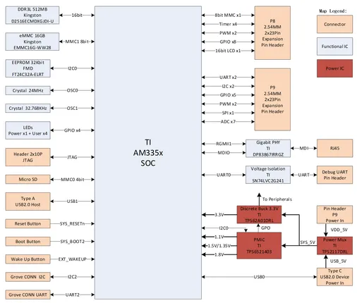
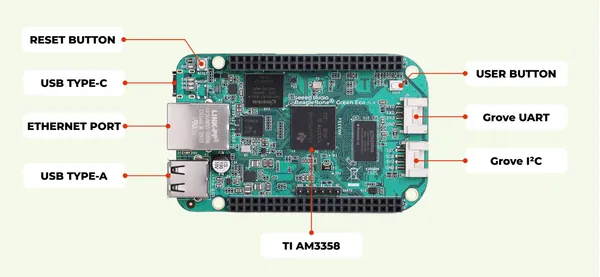
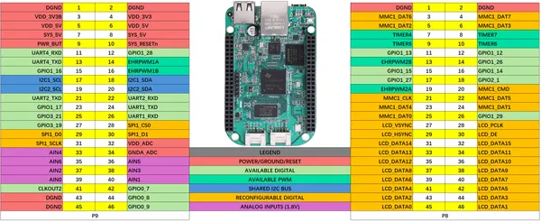
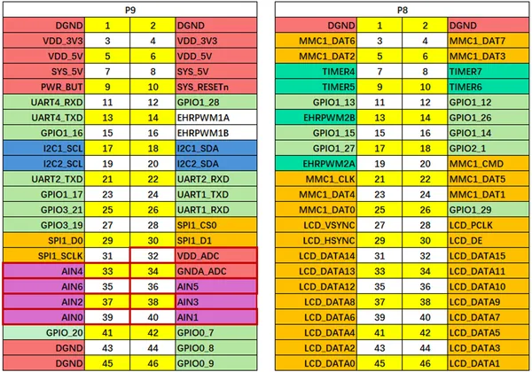
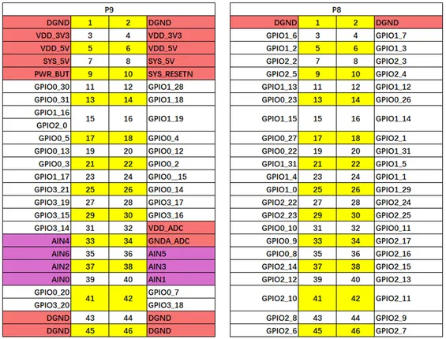
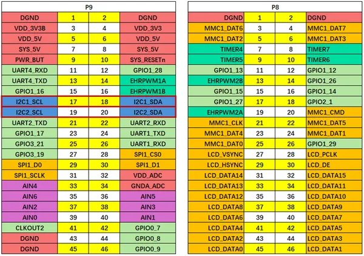
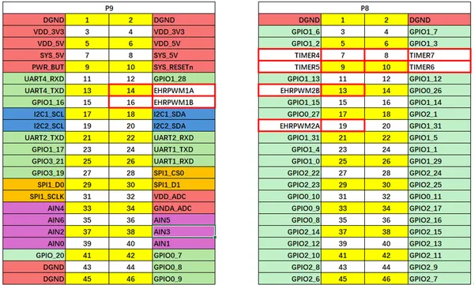
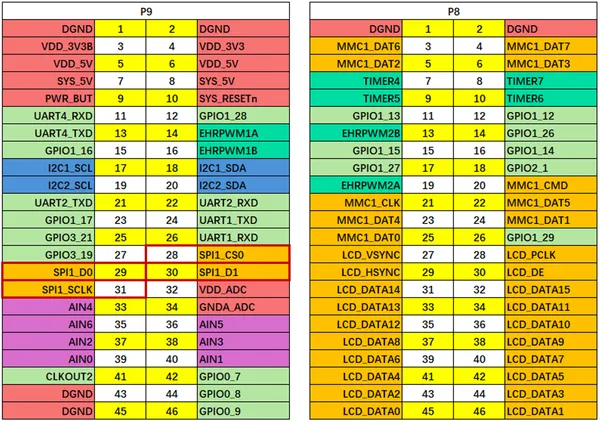
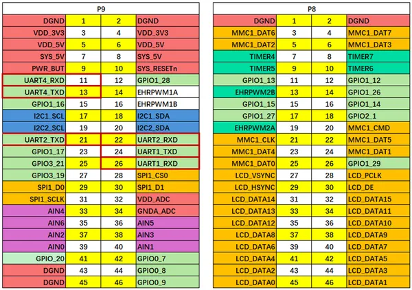

# BeagleBone Green Eco

**Seeed Studio** · Source collection

Revision: Unverified source identity  
Coverage: Source collection; review pending

[Browse all manufacturers](../../../../BROWSE.md) · [Desktop app](https://github.com/valleytechsolutions/black-wire-desktop)

## Block Diagram

**source reference** · Unreviewed source · PNG

[Open original reference](../../../../library/media/066a174e0874393699f4f1c57f25f7cff65568219546156d52e7e801cf7e47a9.png)

**Credit and rights:** Source rights not yet established. Source/manufacturer: Seeed Studio.

[Source 1](https://files.seeedstudio.com/wiki/BeagleBone_Green_Eco/img/Functional-Block-Diagram.png) · [Source 2](https://wiki.seeedstudio.com/getting_started_with_seeedstudio_beaglebone_green_eco/)

Original source index: Block Diagram. This file is searchable but has not been promoted to a reviewed physical board pinout.

SHA-256: `066a174e0874393699f4f1c57f25f7cff65568219546156d52e7e801cf7e47a9`

## Dimensions

**source reference** · Unreviewed source · PDF

[Open original reference](../../../../library/media/a78ee2f448e2394780b52278bf0d08482105556a662e4b74f26f067fd24b671e.pdf)

**Credit and rights:** Source rights not yet established. Source/manufacturer: Seeed Studio.

[Source 1](https://files.seeedstudio.com/products/102111198/res/BBG_Eco_Structure_Reference_20251219.pdf) · [Source 2](https://wiki.seeedstudio.com/getting_started_with_seeedstudio_beaglebone_green_eco/)

Original source index: Dimensions. This file is searchable but has not been promoted to a reviewed physical board pinout.

SHA-256: `a78ee2f448e2394780b52278bf0d08482105556a662e4b74f26f067fd24b671e`

## Hardware Overview

**source reference** · Unreviewed source · PNG

[Open original reference](../../../../library/media/784fc6ca04504fa2eaf963e60ba9d10b099107658edf41a197e8583c0865d11b.png)

**Credit and rights:** Source rights not yet established. Source/manufacturer: Seeed Studio.

[Source 1](https://files.seeedstudio.com/wiki/BeagleBone_Green_Eco/img/Hardware-Overview.png) · [Source 2](https://wiki.seeedstudio.com/getting_started_with_seeedstudio_beaglebone_green_eco/)

Original source index: Hardware Overview. This file is searchable but has not been promoted to a reviewed physical board pinout.

SHA-256: `784fc6ca04504fa2eaf963e60ba9d10b099107658edf41a197e8583c0865d11b`

## Pin Definition Table

**source reference** · Unreviewed source · PNG

[Open original reference](../../../../library/media/f13c2a46a20ef0ddfa81232079c53deb5f152eaf8dc54007fe51b762e1d07aea.png)

**Credit and rights:** Source rights not yet established. Source/manufacturer: Seeed Studio.

[Source 1](https://files.seeedstudio.com/wiki/BeagleBone_Green_Eco/img/1.png) · [Source 2](https://wiki.seeedstudio.com/getting_started_with_seeedstudio_beaglebone_green_eco/)

Original source index: Pin Definition Table. This file is searchable but has not been promoted to a reviewed physical board pinout.

SHA-256: `f13c2a46a20ef0ddfa81232079c53deb5f152eaf8dc54007fe51b762e1d07aea`

## Pin Multiplexing (Analog)

**source reference** · Unreviewed source · PNG

[Open original reference](../../../../library/media/08d478d793e833f5da282072bcd6c009d91719c1e9a3f116e49d28edb71057bd.png)

**Credit and rights:** Source rights not yet established. Source/manufacturer: Seeed Studio.

[Source 1](https://files.seeedstudio.com/wiki/BeagleBone_Green_Eco/img/4.png) · [Source 2](https://wiki.seeedstudio.com/getting_started_with_seeedstudio_beaglebone_green_eco/)

Original source index: Pin Multiplexing (Analog). This file is searchable but has not been promoted to a reviewed physical board pinout.

SHA-256: `08d478d793e833f5da282072bcd6c009d91719c1e9a3f116e49d28edb71057bd`

## Pin Multiplexing (GPIO)

**source reference** · Unreviewed source · PNG

[Open original reference](../../../../library/media/310a2b3e8db5ee09b987cace755858f60fa891e3011c5726b4c18846f039361f.png)

**Credit and rights:** Source rights not yet established. Source/manufacturer: Seeed Studio.

[Source 1](https://files.seeedstudio.com/wiki/BeagleBone_Green_Eco/img/2.png) · [Source 2](https://wiki.seeedstudio.com/getting_started_with_seeedstudio_beaglebone_green_eco/)

Original source index: Pin Multiplexing (GPIO). This file is searchable but has not been promoted to a reviewed physical board pinout.

SHA-256: `310a2b3e8db5ee09b987cace755858f60fa891e3011c5726b4c18846f039361f`

## Pin Multiplexing (I2C)

**source reference** · Unreviewed source · PNG

[Open original reference](../../../../library/media/8d78c85887d25119bbcf44b1c87557a723c91cf980ac27e1fb79a222d9540290.png)

**Credit and rights:** Source rights not yet established. Source/manufacturer: Seeed Studio.

[Source 1](https://files.seeedstudio.com/wiki/BeagleBone_Green_Eco/img/6.png) · [Source 2](https://wiki.seeedstudio.com/getting_started_with_seeedstudio_beaglebone_green_eco/)

Original source index: Pin Multiplexing (I2C). This file is searchable but has not been promoted to a reviewed physical board pinout.

SHA-256: `8d78c85887d25119bbcf44b1c87557a723c91cf980ac27e1fb79a222d9540290`

## Pin Multiplexing (PWM-Timer)

**source reference** · Unreviewed source · PNG

[Open original reference](../../../../library/media/63cc2042efaecb8e62cfdd27a0283d9c04530b07406f2c8f5d0720fe1404948a.png)

**Credit and rights:** Source rights not yet established. Source/manufacturer: Seeed Studio.

[Source 1](https://files.seeedstudio.com/wiki/BeagleBone_Green_Eco/img/3.png) · [Source 2](https://wiki.seeedstudio.com/getting_started_with_seeedstudio_beaglebone_green_eco/)

Original source index: Pin Multiplexing (PWM-Timer). This file is searchable but has not been promoted to a reviewed physical board pinout.

SHA-256: `63cc2042efaecb8e62cfdd27a0283d9c04530b07406f2c8f5d0720fe1404948a`

## Pin Multiplexing (SPI)

**source reference** · Unreviewed source · PNG

[Open original reference](../../../../library/media/d1fb6f010ba9476e66ce3086aa3ed5adcaa638537b3c80f48d725d0ae6e3ad7a.png)

**Credit and rights:** Source rights not yet established. Source/manufacturer: Seeed Studio.

[Source 1](https://files.seeedstudio.com/wiki/BeagleBone_Green_Eco/img/7.png) · [Source 2](https://wiki.seeedstudio.com/getting_started_with_seeedstudio_beaglebone_green_eco/)

Original source index: Pin Multiplexing (SPI). This file is searchable but has not been promoted to a reviewed physical board pinout.

SHA-256: `d1fb6f010ba9476e66ce3086aa3ed5adcaa638537b3c80f48d725d0ae6e3ad7a`

## Pin Multiplexing (UART)

**source reference** · Unreviewed source · PNG

[Open original reference](../../../../library/media/0f434e4ae965280062f72ee903ac46fa97b29ee662af4c8ebfc2d501c954cbbe.png)

**Credit and rights:** Source rights not yet established. Source/manufacturer: Seeed Studio.

[Source 1](https://files.seeedstudio.com/wiki/BeagleBone_Green_Eco/img/5.png) · [Source 2](https://wiki.seeedstudio.com/getting_started_with_seeedstudio_beaglebone_green_eco/)

Original source index: Pin Multiplexing (UART). This file is searchable but has not been promoted to a reviewed physical board pinout.

SHA-256: `0f434e4ae965280062f72ee903ac46fa97b29ee662af4c8ebfc2d501c954cbbe`

Pin assignments have not been independently electrically verified. Check board revision before wiring.
