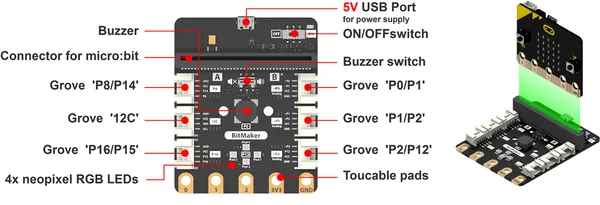

# BitMaker

**Seeed Studio** · Source collection

Revision: Unverified source identity  
Coverage: Source collection; review pending

[Browse all manufacturers](../../../../BROWSE.md) · [Desktop app](https://github.com/valleytechsolutions/black-wire-desktop)

## Hardware Overview

**source reference** · Unreviewed source · PNG

[Open original reference](../../../../library/media/e493c8e2d71ee7336939aa615ee98d0c56d3e730ebfcede44241086e1d887e19.png)

**Credit and rights:** Source rights not yet established. Source/manufacturer: Seeed Studio.

[Source 1](https://files.seeedstudio.com/wiki/microbit/bitmaker/2.png) · [Source 2](https://wiki.seeedstudio.com/BitMaker/)

Original source index: Hardware Overview. This file is searchable but has not been promoted to a reviewed physical board pinout.

SHA-256: `e493c8e2d71ee7336939aa615ee98d0c56d3e730ebfcede44241086e1d887e19`

Pin assignments have not been independently electrically verified. Check board revision before wiring.
