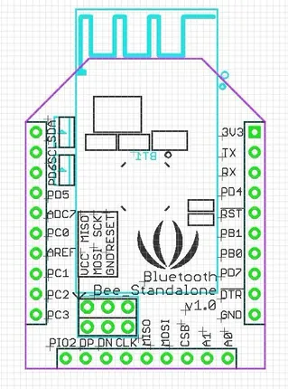

# Bluetooth Bee - Standalone

**Seeed Studio** · Source collection

Revision: Unverified source identity  
Coverage: Source collection; review pending

[Browse all manufacturers](../../../../BROWSE.md) · [Desktop app](https://github.com/valleytechsolutions/black-wire-desktop)

## Standalone - Pinout

**source reference** · Unreviewed source · JPG

[Open original reference](../../../../library/media/28c7b45e9058c6cc66d9f8ba3f5ed711727fffab6c7e53c61c993d88cfcaea6d.jpg)

**Credit and rights:** Source rights not yet established. Source/manufacturer: Seeed Studio.

[Source 1](https://files.seeedstudio.com/wiki/Bluetooth_Bee_Standalone/img/Bluetooth-standalone_pin.jpg) · [Source 2](https://wiki.seeedstudio.com/Bluetooth_Bee_Standalone/)

Original source index: Standalone - Pinout. This file is searchable but has not been promoted to a reviewed physical board pinout.

SHA-256: `28c7b45e9058c6cc66d9f8ba3f5ed711727fffab6c7e53c61c993d88cfcaea6d`

Pin assignments have not been independently electrically verified. Check board revision before wiring.
