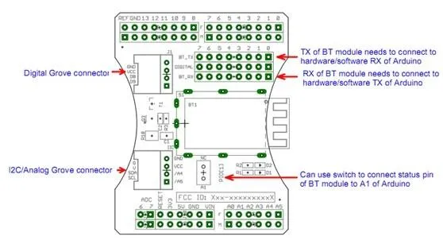

# Bluetooth Shield

**Seeed Studio** · Source collection

Revision: Unverified source identity  
Coverage: Source collection; review pending

[Browse all manufacturers](../../../../BROWSE.md) · [Desktop app](https://github.com/valleytechsolutions/black-wire-desktop)

## Hardware Overview

**source reference** · Unreviewed source · JPG

[Open original reference](../../../../library/media/eb6a7a4c8e4e781a51c247977d11f55f8ac5c3de5cdd7a6bbcff88def455dab4.jpg)

**Credit and rights:** Source rights not yet established. Source/manufacturer: Seeed Studio.

[Source 1](https://files.seeedstudio.com/wiki/Bluetooth-Shield/img/BluetoothInterface.jpg) · [Source 2](https://wiki.seeedstudio.com/Bluetooth_Shield/)

Original source index: Hardware Overview. This file is searchable but has not been promoted to a reviewed physical board pinout.

SHA-256: `eb6a7a4c8e4e781a51c247977d11f55f8ac5c3de5cdd7a6bbcff88def455dab4`

Pin assignments have not been independently electrically verified. Check board revision before wiring.
