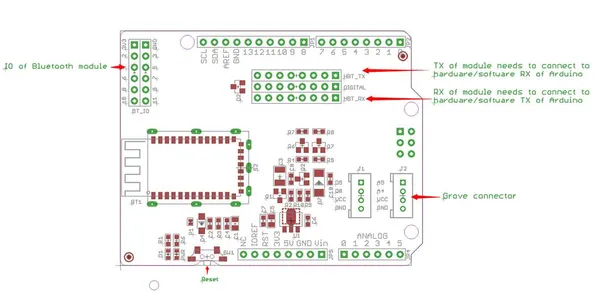

# Bluetooth Shield V2

**Seeed Studio** · Source collection

Revision: Unverified source identity  
Coverage: Source collection; review pending

[Browse all manufacturers](../../../../BROWSE.md) · [Desktop app](https://github.com/valleytechsolutions/black-wire-desktop)

## Hardware Overview

**source reference** · Unreviewed source · JPG

[Open original reference](../../../../library/media/0e75e75550ed026d1ee47b8ddd48ae20634c2a1ee8b88a23847acd2a0bd43e8e.jpg)

**Credit and rights:** Source rights not yet established. Source/manufacturer: Seeed Studio.

[Source 1](https://files.seeedstudio.com/wiki/Bluetooth_Shield_V2/img/Bluetooth_Shield_V2.0_K.jpg) · [Source 2](https://wiki.seeedstudio.com/Bluetooth_Shield_V2/)

Original source index: Hardware Overview. This file is searchable but has not been promoted to a reviewed physical board pinout.

SHA-256: `0e75e75550ed026d1ee47b8ddd48ae20634c2a1ee8b88a23847acd2a0bd43e8e`

Pin assignments have not been independently electrically verified. Check board revision before wiring.
