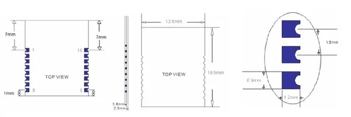

# Bluetooth V4.0 HM-11 BLE Module

**Seeed Studio** · Source collection

Revision: Unverified source identity  
Coverage: Source collection; review pending

[Browse all manufacturers](../../../../BROWSE.md) · [Desktop app](https://github.com/valleytechsolutions/black-wire-desktop)

## Dimensions

**source reference** · Unreviewed source · JPG

[Open original reference](../../../../library/media/500223f91e938f8c901140e307ee39a7dca68a0ca011f280d5a99cb194bfdf59.jpg)

**Credit and rights:** Source rights not yet established. Source/manufacturer: Seeed Studio.

[Source 1](https://files.seeedstudio.com/wiki/Bluetooth_V4.0_HM_11_BLE_Module/img/HM-11_Pinout.jpg) · [Source 2](https://wiki.seeedstudio.com/Bluetooth_V4.0_HM_11_BLE_Module/)

Original source index: Dimensions. This file is searchable but has not been promoted to a reviewed physical board pinout.

SHA-256: `500223f91e938f8c901140e307ee39a7dca68a0ca011f280d5a99cb194bfdf59`

Pin assignments have not been independently electrically verified. Check board revision before wiring.
