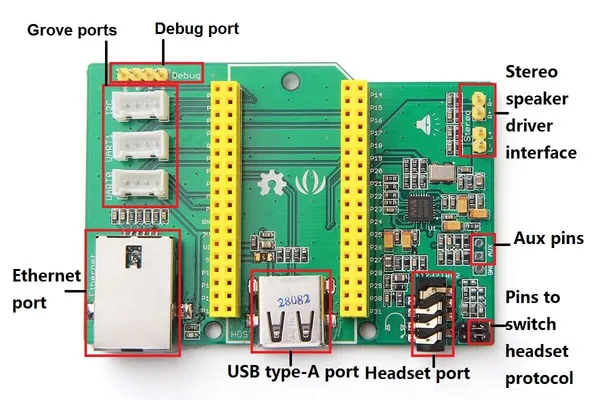
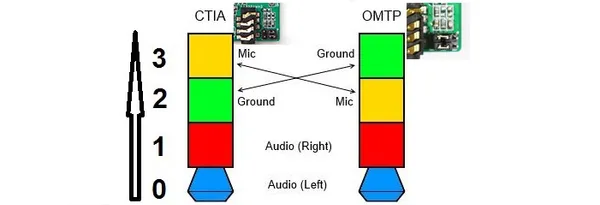

# Breakout for LinkIt Smart 7688 V2.0

**Seeed Studio** · Source collection

Revision: Unverified source identity  
Coverage: Source collection; review pending

[Browse all manufacturers](../../../../BROWSE.md) · [Desktop app](https://github.com/valleytechsolutions/black-wire-desktop)

## Hardware Overview

**source reference** · Unreviewed source · JPG

[Open original reference](../../../../library/media/c8553451e9fa491b1ce6d20ec0773c15b64d93d2d1aaa37e32b0f5ef5cee6d6b.jpg)

**Credit and rights:** Source rights not yet established. Source/manufacturer: Seeed Studio.

[Source 1](https://files.seeedstudio.com/wiki/Breakout_for_LinkIt_Smart_7688_v2_0/image/Breakout_for_LinkIt_Smart_7688_v2.0_hardware_connections_1200_s.jpg) · [Source 2](https://wiki.seeedstudio.com/Breakout_for_LinkIt_Smart_7688_v2.0/)

Original source index: Hardware Overview. This file is searchable but has not been promoted to a reviewed physical board pinout.

SHA-256: `c8553451e9fa491b1ce6d20ec0773c15b64d93d2d1aaa37e32b0f5ef5cee6d6b`

## Pin Functions (Headset CTIA-OMTP Jumper)

**source reference** · Unreviewed source · JPG

[Open original reference](../../../../library/media/d0a8c3c1f518e62fb82f0b912ae4ac90293091b786897dcbb9d043a381b3534e.jpg)

**Credit and rights:** Source rights not yet established. Source/manufacturer: Seeed Studio.

[Source 1](https://files.seeedstudio.com/wiki/Breakout_for_LinkIt_Smart_7688_v2_0/image/Breakout_for_LinkIt_Smart_7688_v2.0_CTIA_OMTP_Switch_Manner.JPG) · [Source 2](https://wiki.seeedstudio.com/Breakout_for_LinkIt_Smart_7688_v2.0/)

Original source index: Pin Functions (Headset CTIA-OMTP Jumper). This file is searchable but has not been promoted to a reviewed physical board pinout.

SHA-256: `d0a8c3c1f518e62fb82f0b912ae4ac90293091b786897dcbb9d043a381b3534e`

Pin assignments have not been independently electrically verified. Check board revision before wiring.
