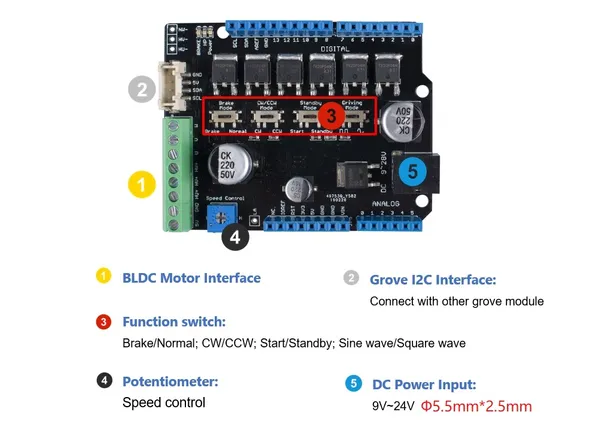

# Brushless Motor Shield (TB6605FTG)

**Seeed Studio** · Source collection

Revision: Unverified source identity

Coverage: Source collection; review pending

[Browse all manufacturers](../../../../BROWSE.md) · [Devices & IoT](../../../../DEVICES.md) · [Open in the browser guide](https://valleytech-black-wire-guide.pages.dev/?board=source-board-6414cf9e032e514c05)

## Datasheets and original documentation

Board datasheet: **not yet recorded**. Visual reference: **available**.

[Manufacturer source (recorded link)](https://wiki.seeedstudio.com/Brushless_Motor_Shield_TB6605FTG/)

A chip datasheet, schematic and board datasheet have different scopes. Match the exact hardware revision.

[Documentation coverage and remaining gaps](../../../../DOCUMENTATION.md)

## Hardware Overview

**source reference** · Unreviewed source · JPG

[Open original reference](../../../../library/media/44114be605724e66cba343cf227484a6d6a88c08a10714f1d7757aa82906f975.jpg)

**Credit and rights:** Source rights not yet established. Source/manufacturer: Seeed Studio.

[Source 1](https://files.seeedstudio.com/wiki/BLDC-Motor-Shield-TB6605/img/pinout.jpg) · [Source 2](https://wiki.seeedstudio.com/Brushless_Motor_Shield_TB6605FTG/)

Original source index: Hardware Overview. This file is searchable but has not been promoted to a reviewed physical board pinout.

Image revision: Not identified

SHA-256: `44114be605724e66cba343cf227484a6d6a88c08a10714f1d7757aa82906f975`

Pin assignments have not been independently electrically verified. Check board revision before wiring.
