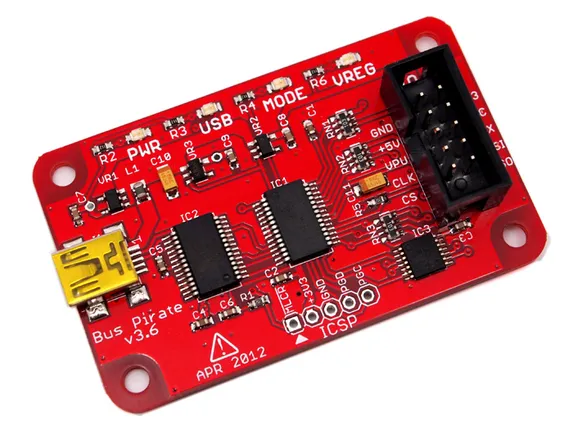

# Bus Pirate V3

**Seeed Studio** · Source collection

Revision: Unverified source identity  
Coverage: Source collection; review pending

[Browse all manufacturers](../../../../BROWSE.md) · [Desktop app](https://github.com/valleytechsolutions/black-wire-desktop)

## Hardware Overview

**source reference** · Unreviewed source · JPG

[Open original reference](../../../../library/media/0dc9260706aab3f64e3d1cbece8606f1e1068008f879cdf0adc1b49a119ce90c.jpg)

**Credit and rights:** Source rights not yet established. Source/manufacturer: Seeed Studio.

[Source 1](https://files.seeedstudio.com/wiki/Bus_Pirate_v3_assembled/img/Bus%20Pirate%20v3.6interface.jpg) · [Source 2](https://wiki.seeedstudio.com/Bus_Pirate_v3_assembled/)

Original source index: Hardware Overview. This file is searchable but has not been promoted to a reviewed physical board pinout.

SHA-256: `0dc9260706aab3f64e3d1cbece8606f1e1068008f879cdf0adc1b49a119ce90c`

Pin assignments have not been independently electrically verified. Check board revision before wiring.
