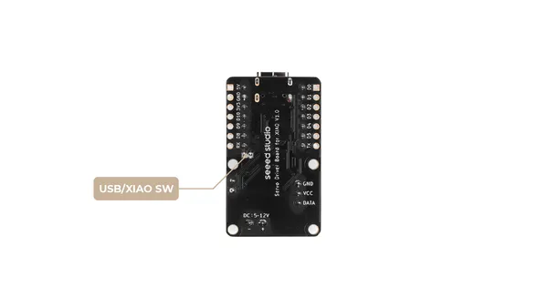
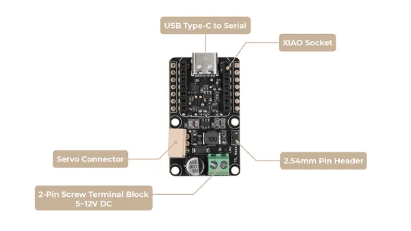
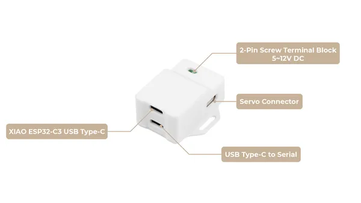

# Bus Servo Driver Board

**Seeed Studio** · Source collection

Revision: Unverified source identity  
Coverage: Source collection; review pending

[Browse all manufacturers](../../../../BROWSE.md) · [Desktop app](https://github.com/valleytechsolutions/black-wire-desktop)

## Hardware Overview (Back)

**source reference** · Unreviewed source · PNG

[Open original reference](../../../../library/media/d3fb4b83ddd21af41b5e371dc84a315f1458cedf0246471455bcb46d3dc4b43e.png)

**Credit and rights:** Source rights not yet established. Source/manufacturer: Seeed Studio.

[Source 1](https://files.seeedstudio.com/wiki/bus_servo_driver_board/2.png) · [Source 2](https://wiki.seeedstudio.com/bus_servo_driver_board/)

Original source index: Hardware Overview (Back). This file is searchable but has not been promoted to a reviewed physical board pinout.

SHA-256: `d3fb4b83ddd21af41b5e371dc84a315f1458cedf0246471455bcb46d3dc4b43e`

## Hardware Overview (Front)

**source reference** · Unreviewed source · PNG

[Open original reference](../../../../library/media/e8182390882fbca79a89e0245fc5a28cb01c2eb5c120e9cf32e1f384c7a5c1c4.png)

**Credit and rights:** Source rights not yet established. Source/manufacturer: Seeed Studio.

[Source 1](https://files.seeedstudio.com/wiki/bus_servo_driver_board/1.png) · [Source 2](https://wiki.seeedstudio.com/bus_servo_driver_board/)

Original source index: Hardware Overview (Front). This file is searchable but has not been promoted to a reviewed physical board pinout.

SHA-256: `e8182390882fbca79a89e0245fc5a28cb01c2eb5c120e9cf32e1f384c7a5c1c4`

## Hardware Overview (Ports, XIAO Bus Servo Adapter)

**source reference** · Unreviewed source · PNG

[Open original reference](../../../../library/media/c20534ce470fae490f79b30b024db8a6ce885227b4dfcf2c61e2b507b1d6cfa1.png)

**Credit and rights:** Source rights not yet established. Source/manufacturer: Seeed Studio.

[Source 1](https://files.seeedstudio.com/wiki/bus_servo_driver_board/3.png) · [Source 2](https://wiki.seeedstudio.com/xiao_bus_servo_adapter/)

Original source index: Hardware Overview (Ports, XIAO Bus Servo Adapter). This file is searchable but has not been promoted to a reviewed physical board pinout.

SHA-256: `c20534ce470fae490f79b30b024db8a6ce885227b4dfcf2c61e2b507b1d6cfa1`

Pin assignments have not been independently electrically verified. Check board revision before wiring.
