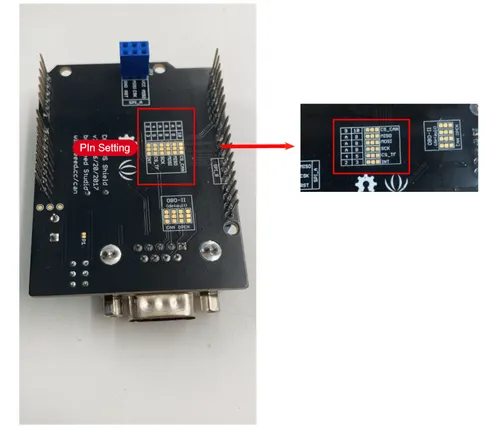
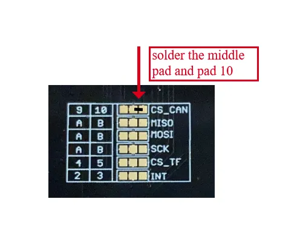
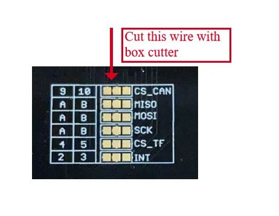

# CAN-BUS Shield V2.0

**Seeed Studio** · Source collection

Revision: Unverified source identity  
Coverage: Source collection; review pending

[Browse all manufacturers](../../../../BROWSE.md) · [Desktop app](https://github.com/valleytechsolutions/black-wire-desktop)

## Hardware Overview

**source reference** · Unreviewed source · PNG

[Open original reference](../../../../library/media/bf7ab93bf8cf71b0cc82bd83821d2eb268d819790e99440545ee289f39a7837e.png)

**Credit and rights:** Source rights not yet established. Source/manufacturer: Seeed Studio.

[Source 1](https://files.seeedstudio.com/wiki/CAN_BUS_Shield/image/zhanshitu1.png) · [Source 2](https://wiki.seeedstudio.com/CAN-BUS_Shield_V2.0/)

Original source index: Hardware Overview. This file is searchable but has not been promoted to a reviewed physical board pinout.

SHA-256: `bf7ab93bf8cf71b0cc82bd83821d2eb268d819790e99440545ee289f39a7837e`

## Pin Multiplexing (CS Select) 2

**source reference** · Unreviewed source · PNG

[Open original reference](../../../../library/media/85f3f50131559f9d6e26590700f12903de62a4bdb97270335209870dca51ccda.png)

**Credit and rights:** Source rights not yet established. Source/manufacturer: Seeed Studio.

[Source 1](https://files.seeedstudio.com/wiki/CAN_BUS_Shield/image/zhanshitu3.png) · [Source 2](https://wiki.seeedstudio.com/CAN-BUS_Shield_V2.0/)

Original source index: Pin Multiplexing (CS Select) 2. This file is searchable but has not been promoted to a reviewed physical board pinout.

SHA-256: `85f3f50131559f9d6e26590700f12903de62a4bdb97270335209870dca51ccda`

## Pin Multiplexing (CS Select)

**source reference** · Unreviewed source · PNG

[Open original reference](../../../../library/media/6c08fb0b5b2955245d05c3d56bc254a66667b1215e2f686dca4e6f8a6c39fc6e.png)

**Credit and rights:** Source rights not yet established. Source/manufacturer: Seeed Studio.

[Source 1](https://files.seeedstudio.com/wiki/CAN_BUS_Shield/image/zhanshitu2.png) · [Source 2](https://wiki.seeedstudio.com/CAN-BUS_Shield_V2.0/)

Original source index: Pin Multiplexing (CS Select). This file is searchable but has not been promoted to a reviewed physical board pinout.

SHA-256: `6c08fb0b5b2955245d05c3d56bc254a66667b1215e2f686dca4e6f8a6c39fc6e`

Pin assignments have not been independently electrically verified. Check board revision before wiring.
