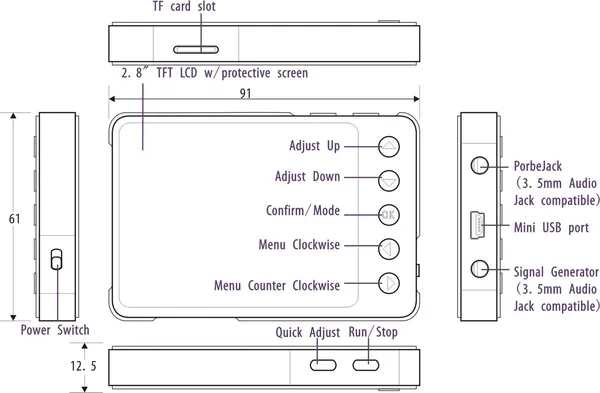

# DSO Nano V3

**Seeed Studio** · Source collection

Revision: Unverified source identity  
Coverage: Source collection; review pending

[Browse all manufacturers](../../../../BROWSE.md) · [Desktop app](https://github.com/valleytechsolutions/black-wire-desktop)

## Hardware Overview

**source reference** · Unreviewed source · JPG

[Open original reference](../../../../library/media/b9e308bd10fc8f611a631e538df09fbe3c619cb3266c1b96a6a8181d040f5cd3.jpg)

**Credit and rights:** Source rights not yet established. Source/manufacturer: Seeed Studio.

[Source 1](https://files.seeedstudio.com/wiki/DSO_Nano_v3/img/DSO_Nano_v3_Structure.jpg) · [Source 2](https://wiki.seeedstudio.com/DSO_Nano_v3/)

Original source index: Hardware Overview. This file is searchable but has not been promoted to a reviewed physical board pinout.

SHA-256: `b9e308bd10fc8f611a631e538df09fbe3c619cb3266c1b96a6a8181d040f5cd3`

Pin assignments have not been independently electrically verified. Check board revision before wiring.
