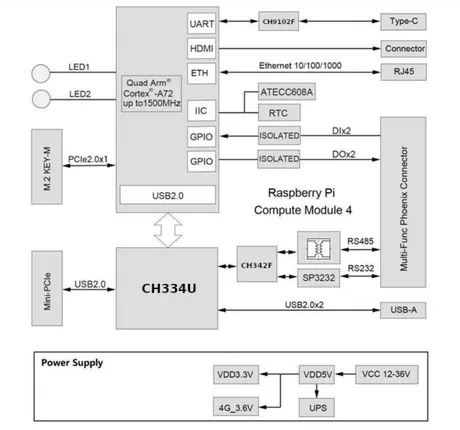
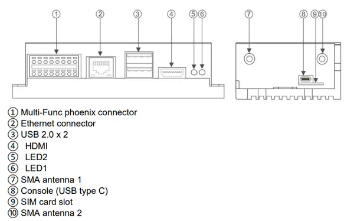
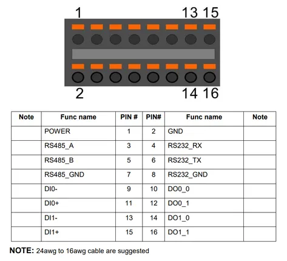
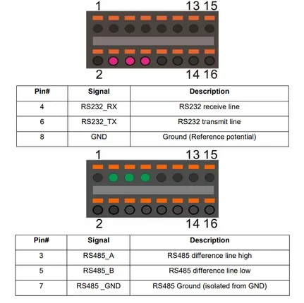

# Edge Box RPi-200

**Seeed Studio** · Source collection

Revision: Unverified source identity  
Coverage: Source collection; review pending

[Browse all manufacturers](../../../../BROWSE.md) · [Desktop app](https://github.com/valleytechsolutions/black-wire-desktop)

## Block Diagram

**source reference** · Unreviewed source · PNG

[Open original reference](../../../../library/media/b108f73c47e755654af7ebba1ca6083baf116cc6a9e143be0c8f52738d5933da.png)

**Credit and rights:** Source rights not yet established. Source/manufacturer: Seeed Studio.

[Source 1](https://files.seeedstudio.com/wiki/Edge_Box/Edgebox_intro/blockdiagram.PNG) · [Source 2](https://wiki.seeedstudio.com/Edge_Box_introduction/)

Original source index: Block Diagram. This file is searchable but has not been promoted to a reviewed physical board pinout.

SHA-256: `b108f73c47e755654af7ebba1ca6083baf116cc6a9e143be0c8f52738d5933da`

## Hardware Overview

**source reference** · Unreviewed source · PNG

[Open original reference](../../../../library/media/253f408133e6f11ceceffb6a7a77ceacc7ff5e81af997adf64f42c11c018e1c8.png)

**Credit and rights:** Source rights not yet established. Source/manufacturer: Seeed Studio.

[Source 1](https://files.seeedstudio.com/wiki/Edge_Box/Edgebox_intro/interfaces.PNG) · [Source 2](https://wiki.seeedstudio.com/Edge_Box_introduction/)

Original source index: Hardware Overview. This file is searchable but has not been promoted to a reviewed physical board pinout.

SHA-256: `253f408133e6f11ceceffb6a7a77ceacc7ff5e81af997adf64f42c11c018e1c8`

## Pin Definition Table (Phoenix Connector)

**source reference** · Unreviewed source · PNG

[Open original reference](../../../../library/media/0b97f0193311f113f0bcd1603ba6678780b28440f9067b28c576e47f4784e3c3.png)

**Credit and rights:** Source rights not yet established. Source/manufacturer: Seeed Studio.

[Source 1](https://files.seeedstudio.com/wiki/Edge_Box/Edgebox_intro/pinout.PNG) · [Source 2](https://wiki.seeedstudio.com/Edge_Box_introduction/)

Original source index: Pin Definition Table (Phoenix Connector). This file is searchable but has not been promoted to a reviewed physical board pinout.

SHA-256: `0b97f0193311f113f0bcd1603ba6678780b28440f9067b28c576e47f4784e3c3`

## Pin Definition Table (Serial Ports)

**source reference** · Unreviewed source · PNG

[Open original reference](../../../../library/media/8efe2c7a07280b53bbe005519ab29b6a3bb65ff569d859c4f3adb18f0dfcd41d.png)

**Credit and rights:** Source rights not yet established. Source/manufacturer: Seeed Studio.

[Source 1](https://files.seeedstudio.com/wiki/Edge_Box/Edgebox_intro/serial.PNG) · [Source 2](https://wiki.seeedstudio.com/Edge_Box_introduction/)

Original source index: Pin Definition Table (Serial Ports). This file is searchable but has not been promoted to a reviewed physical board pinout.

SHA-256: `8efe2c7a07280b53bbe005519ab29b6a3bb65ff569d859c4f3adb18f0dfcd41d`

Pin assignments have not been independently electrically verified. Check board revision before wiring.
