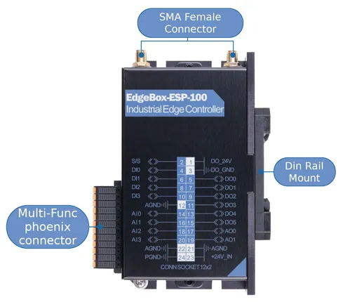
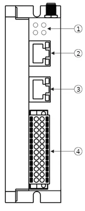
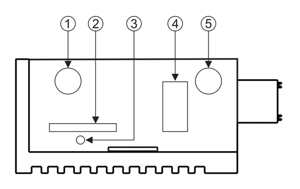
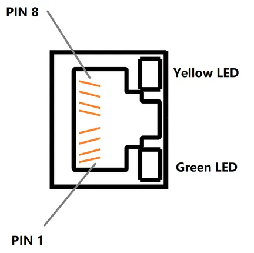
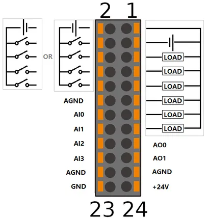
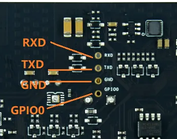

# EdgeBox-ESP-100

**Seeed Studio** · Source collection

Revision: Unverified source identity  
Coverage: Source collection; review pending

[Browse all manufacturers](../../../../BROWSE.md) · [Desktop app](https://github.com/valleytechsolutions/black-wire-desktop)

## Hardware Overview (Front)

**source reference** · Unreviewed source · PNG

[Open original reference](../../../../library/media/4e5e4e27d6846bd8dd5a806533421fe2f1509da93ce0cba9a62dc7ecf6827ad5.png)

**Credit and rights:** Source rights not yet established. Source/manufacturer: Seeed Studio.

[Source 1](https://files.seeedstudio.com/wiki/edge_box_esp/font-port.png) · [Source 2](https://wiki.seeedstudio.com/Edgebox-ESP-100-Arduino/)

Original source index: Hardware Overview (Front). This file is searchable but has not been promoted to a reviewed physical board pinout.

SHA-256: `4e5e4e27d6846bd8dd5a806533421fe2f1509da93ce0cba9a62dc7ecf6827ad5`

## Hardware Overview (Side)

**source reference** · Unreviewed source · PNG

[Open original reference](../../../../library/media/f75f8247668ef30ebb5d589d836b13fe4f4a7d04f9e715fa874a6143fcb0b4bb.png)

**Credit and rights:** Source rights not yet established. Source/manufacturer: Seeed Studio.

[Source 1](https://files.seeedstudio.com/wiki/edge_box_esp/connector_side.png) · [Source 2](https://wiki.seeedstudio.com/Edgebox-ESP-100-Arduino/)

Original source index: Hardware Overview (Side). This file is searchable but has not been promoted to a reviewed physical board pinout.

SHA-256: `f75f8247668ef30ebb5d589d836b13fe4f4a7d04f9e715fa874a6143fcb0b4bb`

## Hardware Overview (Top)

**source reference** · Unreviewed source · PNG

[Open original reference](../../../../library/media/3719a5a80a74ed369c6ceae37fe161190a90f187e34a69f9646c6ad2959eb709.png)

**Credit and rights:** Source rights not yet established. Source/manufacturer: Seeed Studio.

[Source 1](https://files.seeedstudio.com/wiki/edge_box_esp/connector_top.png) · [Source 2](https://wiki.seeedstudio.com/Edgebox-ESP-100-Arduino/)

Original source index: Hardware Overview (Top). This file is searchable but has not been promoted to a reviewed physical board pinout.

SHA-256: `3719a5a80a74ed369c6ceae37fe161190a90f187e34a69f9646c6ad2959eb709`

## Pin Definition (Ethernet Port)

**source reference** · Unreviewed source · PNG

[Open original reference](../../../../library/media/bbad8e0554520e60b7438a1e7d90794720ed7715ec8c1182ca2052b2bb63b4fe.png)

**Credit and rights:** Source rights not yet established. Source/manufacturer: Seeed Studio.

[Source 1](https://files.seeedstudio.com/wiki/edge_box_esp/eth.png) · [Source 2](https://wiki.seeedstudio.com/Edgebox-ESP-100-Arduino/)

Original source index: Pin Definition (Ethernet Port). This file is searchable but has not been promoted to a reviewed physical board pinout.

SHA-256: `bbad8e0554520e60b7438a1e7d90794720ed7715ec8c1182ca2052b2bb63b4fe`

## Pin Definition (Multi-Func Connector)

**source reference** · Unreviewed source · PNG

[Open original reference](../../../../library/media/7d18f065273a8ab9438087492801da584cc81906004d0c807d92bb296f5c5829.png)

**Credit and rights:** Source rights not yet established. Source/manufacturer: Seeed Studio.

[Source 1](https://files.seeedstudio.com/wiki/edge_box_esp/multi-func-connector.png) · [Source 2](https://wiki.seeedstudio.com/Edgebox-ESP-100-Arduino/)

Original source index: Pin Definition (Multi-Func Connector). This file is searchable but has not been promoted to a reviewed physical board pinout.

SHA-256: `7d18f065273a8ab9438087492801da584cc81906004d0c807d92bb296f5c5829`

## Pin Definition (Programming Port)

**source reference** · Unreviewed source · PNG

[Open original reference](../../../../library/media/f051181f8ad3c4ea04f7fd203db7a5344470c6776436c4072e71dbde870eb19a.png)

**Credit and rights:** Source rights not yet established. Source/manufacturer: Seeed Studio.

[Source 1](https://files.seeedstudio.com/wiki/edge_box_esp/programming_port.png) · [Source 2](https://wiki.seeedstudio.com/Edgebox-ESP-100-Arduino/)

Original source index: Pin Definition (Programming Port). This file is searchable but has not been promoted to a reviewed physical board pinout.

SHA-256: `f051181f8ad3c4ea04f7fd203db7a5344470c6776436c4072e71dbde870eb19a`

Pin assignments have not been independently electrically verified. Check board revision before wiring.
