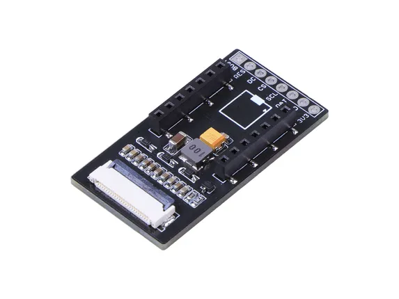
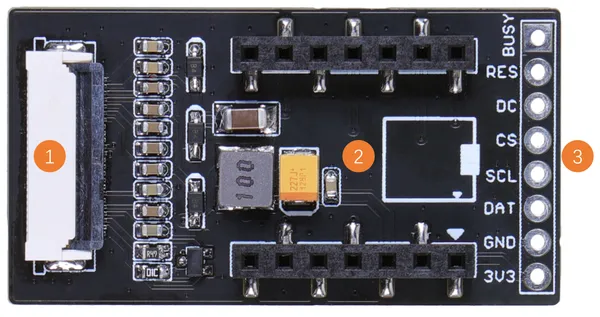

# ePaper Breakout Board for XIAO

**Seeed Studio** · Source collection

Revision: Unverified source identity  
Coverage: Source collection; review pending

[Browse all manufacturers](../../../../BROWSE.md) · [Desktop app](https://github.com/valleytechsolutions/black-wire-desktop)

## Hardware Overview (Back)

**source reference** · Unreviewed source · JPG

[Open original reference](../../../../library/media/3bc60d4c70fe1351bc4125dc1022f084929a2d90ca67c3c9c9e2c986a6790089.jpg)

**Credit and rights:** Source rights not yet established. Source/manufacturer: Seeed Studio.

[Source 1](https://media-cdn.seeedstudio.com/media/catalog/product/cache/bb49d3ec4ee05b6f018e93f896b8a25d/4/-/4-105990172-epaper-breakout-board-45back.jpg) · [Source 2](https://wiki.seeedstudio.com/XIAO-eInk-Expansion-Board/)

Original source index: Hardware Overview (Back). This file is searchable but has not been promoted to a reviewed physical board pinout.

SHA-256: `3bc60d4c70fe1351bc4125dc1022f084929a2d90ca67c3c9c9e2c986a6790089`

## Hardware Overview

**source reference** · Unreviewed source · PNG

[Open original reference](../../../../library/media/87739d72ca72b69c02cbc9591c9d51b4f732a07b17f82567af8e26a772339857.png)

**Credit and rights:** Source rights not yet established. Source/manufacturer: Seeed Studio.

[Source 1](https://files.seeedstudio.com/wiki/eInk/xiao-expansion/xiao-expansion.png) · [Source 2](https://wiki.seeedstudio.com/XIAO-eInk-Expansion-Board/)

Original source index: Hardware Overview. This file is searchable but has not been promoted to a reviewed physical board pinout.

SHA-256: `87739d72ca72b69c02cbc9591c9d51b4f732a07b17f82567af8e26a772339857`

Pin assignments have not been independently electrically verified. Check board revision before wiring.
