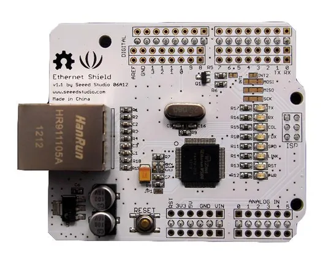
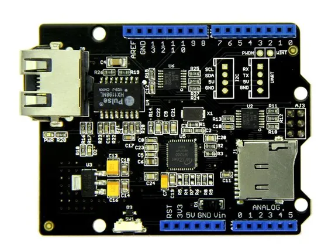
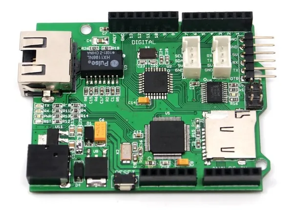

# Ethernet Shield

**Seeed Studio** · Source collection

Revision: Unverified source identity  
Coverage: Source collection; review pending

[Browse all manufacturers](../../../../BROWSE.md) · [Desktop app](https://github.com/valleytechsolutions/black-wire-desktop)

## Hardware Overview 2

**source reference** · Unreviewed source · JPG

[Open original reference](../../../../library/media/43485f0813e3d34625940f0ca876338ca3f4f110a0131aa8a56e5dbad939140c.jpg)

**Credit and rights:** Source rights not yet established. Source/manufacturer: Seeed Studio.

[Source 1](https://files.seeedstudio.com/wiki/Ethernet_Shield/img/Ethernet_01.jpg) · [Source 2](https://wiki.seeedstudio.com/Ethernet_Shield/)

Original source index: Hardware Overview 2. This file is searchable but has not been promoted to a reviewed physical board pinout.

SHA-256: `43485f0813e3d34625940f0ca876338ca3f4f110a0131aa8a56e5dbad939140c`

## Hardware Overview 3

**source reference** · Unreviewed source · JPG

[Open original reference](../../../../library/media/ea8543526080ff27c97aa665c6610210d80b6426615533e476ae91824bd56d64.jpg)

**Credit and rights:** Source rights not yet established. Source/manufacturer: Seeed Studio.

[Source 1](https://files.seeedstudio.com/wiki/Ethernet_Shield/img/W5200_Ethernet_Shield.jpg) · [Source 2](https://wiki.seeedstudio.com/Ethernet_Shield/)

Original source index: Hardware Overview 3. This file is searchable but has not been promoted to a reviewed physical board pinout.

SHA-256: `ea8543526080ff27c97aa665c6610210d80b6426615533e476ae91824bd56d64`

## Hardware Overview

**source reference** · Unreviewed source · JPG

[Open original reference](../../../../library/media/cd0398d7956ab1a981424a7f3d1a41d992fbe5d67a9bee9c0dc85e53a604b388.jpg)

**Credit and rights:** Source rights not yet established. Source/manufacturer: Seeed Studio.

[Source 1](https://files.seeedstudio.com/wiki/Ethernet_Shield/img/Seeeduino_ethernet-2.jpg) · [Source 2](https://wiki.seeedstudio.com/Ethernet_Shield/)

Original source index: Hardware Overview. This file is searchable but has not been promoted to a reviewed physical board pinout.

SHA-256: `cd0398d7956ab1a981424a7f3d1a41d992fbe5d67a9bee9c0dc85e53a604b388`

Pin assignments have not been independently electrically verified. Check board revision before wiring.
