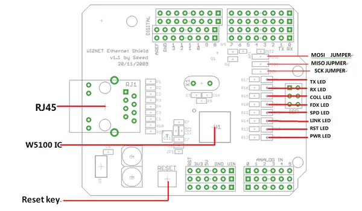

# Ethernet Shield V1.0

**Seeed Studio** · Source collection

Revision: Unverified source identity  
Coverage: Source collection; review pending

[Browse all manufacturers](../../../../BROWSE.md) · [Desktop app](https://github.com/valleytechsolutions/black-wire-desktop)

## Hardware Overview

**source reference** · Unreviewed source · PNG

[Open original reference](../../../../library/media/bc7173d5241c99ee6f75069dc3f4f6cb6603d47ac36a825cb342915230d77a07.png)

**Credit and rights:** Source rights not yet established. Source/manufacturer: Seeed Studio.

[Source 1](https://files.seeedstudio.com/wiki/Ethernet_Shield_V1.0/img/Ethernet-hard1.png) · [Source 2](https://wiki.seeedstudio.com/Ethernet_Shield_V1.0/)

Original source index: Hardware Overview. This file is searchable but has not been promoted to a reviewed physical board pinout.

SHA-256: `bc7173d5241c99ee6f75069dc3f4f6cb6603d47ac36a825cb342915230d77a07`

Pin assignments have not been independently electrically verified. Check board revision before wiring.
