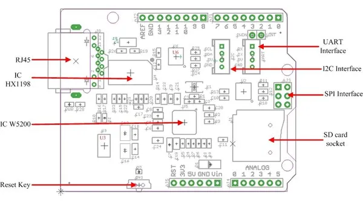

# Ethernet Shield V2.0

**Seeed Studio** · Source collection

Revision: Unverified source identity  
Coverage: Source collection; review pending

[Browse all manufacturers](../../../../BROWSE.md) · [Desktop app](https://github.com/valleytechsolutions/black-wire-desktop)

## Hardware Overview

**source reference** · Unreviewed source · JPG

[Open original reference](../../../../library/media/ea888f4776aa541356f3280f1a705ab91576a71da2d68694d24202ded3584b11.jpg)

**Credit and rights:** Source rights not yet established. Source/manufacturer: Seeed Studio.

[Source 1](https://files.seeedstudio.com/wiki/Ethernet_Shield_V2.0/img/Ethernet_Interface.jpg) · [Source 2](https://wiki.seeedstudio.com/Ethernet_Shield_V2.0/)

Original source index: Hardware Overview. This file is searchable but has not been promoted to a reviewed physical board pinout.

SHA-256: `ea888f4776aa541356f3280f1a705ab91576a71da2d68694d24202ded3584b11`

Pin assignments have not been independently electrically verified. Check board revision before wiring.
