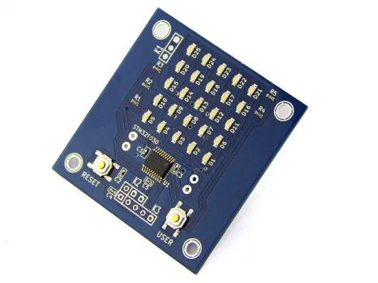

# FSM-55

**Seeed Studio** · Source collection

Revision: Unverified source identity  
Coverage: Source collection; review pending

[Browse all manufacturers](../../../../BROWSE.md) · [Desktop app](https://github.com/valleytechsolutions/black-wire-desktop)

## Hardware Overview

**source reference** · Unreviewed source · JPG

[Open original reference](../../../../library/media/9a82c91952224c7e2c6a6ae90b7f518898335fe2ad37561e381cef83260c9430.jpg)

**Credit and rights:** Source rights not yet established. Source/manufacturer: Seeed Studio.

[Source 1](https://files.seeedstudio.com/wiki/FSM-55/img/FSM-55_board.jpg) · [Source 2](https://wiki.seeedstudio.com/FSM-55/)

Original source index: Hardware Overview. This file is searchable but has not been promoted to a reviewed physical board pinout.

SHA-256: `9a82c91952224c7e2c6a6ae90b7f518898335fe2ad37561e381cef83260c9430`

Pin assignments have not been independently electrically verified. Check board revision before wiring.
