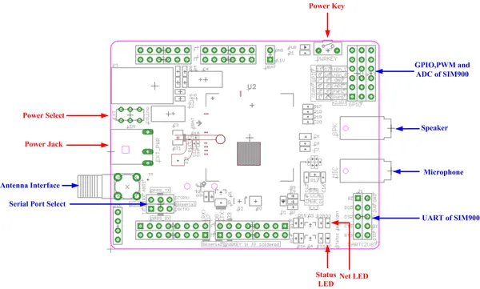

# GPRS Shield V1.0

**Seeed Studio** · Source collection

Revision: Unverified source identity  
Coverage: Source collection; review pending

[Browse all manufacturers](../../../../BROWSE.md) · [Desktop app](https://github.com/valleytechsolutions/black-wire-desktop)

## Hardware Overview

**source reference** · Unreviewed source · PNG

[Open original reference](../../../../library/media/eb39632b6420c49367478071410f3ba6f1c97bdfa7378011aae7ccde9eb7d727.png)

**Credit and rights:** Source rights not yet established. Source/manufacturer: Seeed Studio.

[Source 1](https://files.seeedstudio.com/wiki/GPRS_Shield_v1.0/img/GPRS_Shield_interface.png) · [Source 2](https://wiki.seeedstudio.com/GPRS_Shield_v1.0/)

Original source index: Hardware Overview. This file is searchable but has not been promoted to a reviewed physical board pinout.

SHA-256: `eb39632b6420c49367478071410f3ba6f1c97bdfa7378011aae7ccde9eb7d727`

Pin assignments have not been independently electrically verified. Check board revision before wiring.
