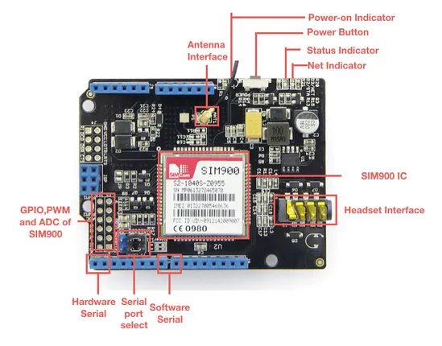

# GPRS Shield V2.0

**Seeed Studio** · Source collection

Revision: Unverified source identity  
Coverage: Source collection; review pending

[Browse all manufacturers](../../../../BROWSE.md) · [Desktop app](https://github.com/valleytechsolutions/black-wire-desktop)

## Hardware Overview

**source reference** · Unreviewed source · PNG

[Open original reference](../../../../library/media/1dfd6c306e2a2e16f575450552c5c8ee6e506173b6fa4007ef3833d2635abae8.png)

**Credit and rights:** Source rights not yet established. Source/manufacturer: Seeed Studio.

[Source 1](https://files.seeedstudio.com/wiki/GPRS_Shield_V2.0/img/GPRS_Shild_V2_hardware_overview.jpg) · [Source 2](https://wiki.seeedstudio.com/GPRS_Shield_V2.0/)

Original source index: Hardware Overview. This file is searchable but has not been promoted to a reviewed physical board pinout.

SHA-256: `1dfd6c306e2a2e16f575450552c5c8ee6e506173b6fa4007ef3833d2635abae8`

Pin assignments have not been independently electrically verified. Check board revision before wiring.
